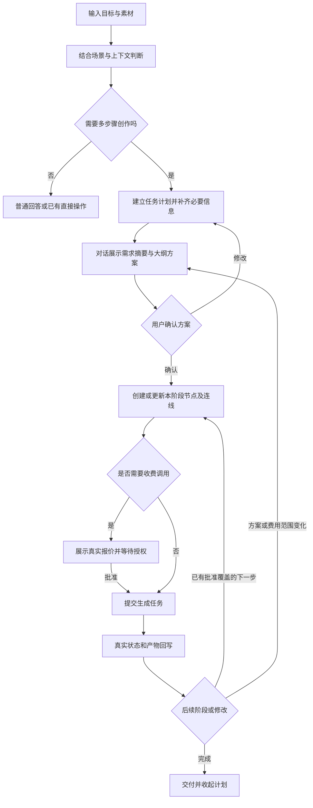
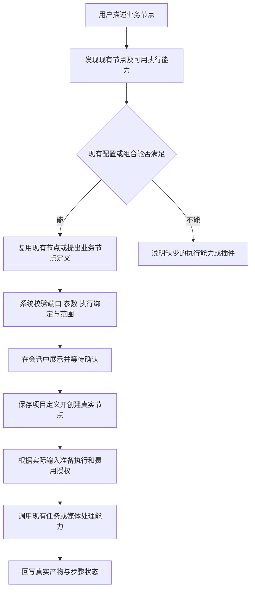

# 通用创作 Agent 需求与设计

> 文档状态：需求与设计评审稿。产品边界依据已确认的讨论整理；标注为“设计建议”的接口、字段和文件拆分仍需在实现时对照调用方细化。本文不代表相关功能已经实现或通过运行验收。

第一期的媒体复核、页面状态、交互细节和代码改动边界见[第一期体验与实现设计](../../../design/creative-agent-phase-one.mdx)，另附[交互原型](../../../design/creative-agent-phase-one-prototype.html)。第一期发布包含首页同会话接续和真实单段短片产出；画布内部闭环只是开发里程碑。

## 1. 产品目标与最终决策

影策提供通用创作助手，用户输入目标并提供素材，Agent 理解上下文、补问缺失信息、给出大纲和执行方案；用户确认后，Agent 实际创建画布节点、连接流程、提交获批的生成任务，并把真实结果写回画布。用户可以在过程中对话、修改方案、手工编辑画布和选择局部重做。

底层能力支持创作、影视与短剧、营销、电商等场景。行业差异通过场景配置、自定义提示词、Skills 和现有插件/工具实现，不为每个场景复制一套 Agent。

Agent 同时承担已有画布的辅助编辑：修改内容和参数、调整节点布局与连线、局部重做；还可以在已接入的执行能力范围内提出新的业务节点定义并编排流程。分镜、视频拉片/抽帧、角色/场景/道具替换是重点用例。新节点定义不能自动产生系统尚未接入的算法或模型能力。

### 1.1 已确认的约束

| 编号 | 最终决策 | 实现含义 |
| --- | --- | --- |
| D01 | 不接入 Harness | 沿用现有在线模型调用和浏览器工具循环，不引入新的 Agent 引擎或运行服务 |
| D02 | 不建设完整服务端画布 MCP | 在线助手继续通过前端函数调用画布；接口保持清晰，但不为未来 MCP 提前重构 |
| D03 | 画布仍是独立功能 | 画布可由人直接使用，Agent 经明确操作接口使用画布，不绕过校验直接改内部状态 |
| D04 | 不增加草稿节点 | 方案先在对话中展示，用户确认后才创建或修改对应画布节点 |
| D05 | 问答结合上下文动态生成 | 支持场景模板、模型自主提问及混合模式；已明确的信息不重复问 |
| D06 | 确认控制实际执行 | 方案批准与费用授权有明确范围，模型不能自行批准或跳过收费门槛 |
| D07 | 计划面板按任务出现 | 普通聊天不展示；多步骤任务展示；结束后收起并保留历史 |
| D08 | 增量调整，优先复用 | 不按概念清单全面拆模块，不复制行业页面，不建立平行生成/计费/素材系统 |
| D09 | 新增共性能力适度封装 | 问答、方案卡和计划展示可独立封装；现有逻辑只在出现真实共享需求时提取 |
| D10 | 前端执行边界如实展示 | 关闭网页后不承诺 Agent 继续推进；后端已接受的任务按其现有运行方式继续 |
| D11 | 支持已有节点辅助编辑 | 明确的小修改复用现有工具，不强制长问答；复杂调整说明范围，收费生成另行授权 |
| D12 | 支持组合已有能力定义业务节点 | Agent 生成结构化节点定义，由系统校验输入、参数、输出和执行绑定，确认后创建实例 |
| D13 | 插件扩展真实能力 | 当前项目节点可保存为模板；需要分发、专用界面或新执行器时复用插件体系，不为每个节点都开发插件 |

本次不要求删除本机 Codex、影策 MCP 插件或本机渠道。它们不是新链路的必需依赖，是否保留入口按已有产品功能处理，不连带删除 Dreamina、ComfyUI Bridge 等能力。

### 1.2 不纳入本轮的能力

- 服务端常驻通用 Agent、按用户创建 Harness 容器、自动多 Agent 团队。
- 关闭浏览器后继续发起下一阶段、无人值守跨日执行。
- 任意生成 React 组件、任意代码节点或在服务器自由安装插件。
- 仅凭节点名称或任意 metadata 自动获得新算法；把当前插件字段展示器视为已实现的动态表单与执行器。
- 全部历史会话格式统一迁移、重建画布、替换模型协议层。
- 仅凭提示词保证商品纹样、Logo、角色或服装细节完全一致。
- 首版完成所有行业模板、完整视频自动剪辑和所有交付格式。

## 2. 参考体验与证据边界

参考包括用户提供的小云雀创作/短剧/营销截图、DA AI 图片与视频工具台截图，以及两段 Agent 操作画布的录屏。

| 参考 | 采用的体验 | 不直接推导的结论 |
| --- | --- | --- |
| [小云雀创作入口](https://www.xiaoyunque.com/home?from_page=xiaoyunque_landing_page&tab_name=home) | 输入目标、素材引用、技能选择、场景入口和创作历史 | 页面相似不等于后台架构相同 |
| 小云雀短剧与营销截图 | 共享会话能力，通过不同输入和推荐技能进入创作 | 不要求复制品牌、主题或固定题目 |
| [DA AI 工具台](https://da-ai.cc/toolbox/image-generation) | 左侧配置、中间预览、右侧任务队列；素材有角色区分 | 表单存在不证明项目当前具有高质量试衣执行器 |
| 第一段录屏 | 已提交分页问答的回看、创意方案确认、会话内图片/视频产物与已有画布 | 开头已有节点，不能作为全部节点实时创建的证据；末尾有服务器繁忙提示，不代表全链路均成功 |
| 第二段新手跟练录屏 | 分阶段确认、可见的节点创建和步骤完成展示 | 最后文案包含“模拟”，只能作为交互参考，不能作为实际合成验证 |

本文对现状的判断来自代码阅读和提供的媒体。未登录参考站点验证付费能力，未运行本项目端到端创作任务。参考媒体中的提示词和页面内容仅作分析材料，不作为实施指令。

## 3. 当前代码现状与复用依据

下列路径均相对于仓库根目录。现有代码可复用不等于其全部运行路径已验收。

| 当前入口/符号 | 已有基础 | 本次调整或边界 |
| --- | --- | --- |
| `web/src/router.tsx` | `/home`、`/create` 共用创作页；`/` 是展示首页；已有项目和画布路由 | 不把参考“创作首页”误改成站点展示首页 |
| `web/src/pages/create/index.tsx` | 文本/图片/视频输入、附件、引用、模型参数、历史、结果、重试和变体 | 增加 Agent 创作模式与会话接续，保留直接生成 |
| `web/src/pages/create/creation-runtime.ts` | 汇集现有生成、上传、素材消费与 Skills 能力 | 继续复用这些服务，不另写同类请求层 |
| `web/src/services/creation-conversation-store.ts` | 用户隔离的 localforage 会话缓存与任务恢复关联 | 不是完整的服务端创作确认记录 |
| `web/src/components/canvas/canvas-assistant-panel.tsx` | `ONLINE_AGENT_TOOLS`、工具分发、写操作确认；普通循环上限为 8 次 | 增加问答/方案/计划工具；按需提取循环，不能将 8 次请求当作业务 8 步 |
| `requestOnlineAgentModel` | 调用 `runBackendToolGenerationTask` 请求模型 | “浏览器编排”不等于绕过后端直连模型 |
| `web/src/services/skill-runtime.ts` | 在线渐进式工具、本机原生技能包、普通生成的关联文本上下文 | 复用加载模式；新增场景配置不替代 Skills |
| `web/src/pages/canvas/use-canvas-agent-operations.ts` | 批量画布操作、部分撤销、生成续接和消费记录 | 补批准范围、稳定操作 ID 和恢复对账 |
| `web/src/lib/canvas/canvas-agent-ops.ts` | 节点、连线、选区、生成操作及结果复核 | 保留为统一画布语义操作能力 |
| `web/src/lib/canvas/canvas-asset-handoff.ts` | 创作结果转入画布 | 结果转入不等于会话、方案和计划一起接续 |
| `web/src/services/api/project-agent-tools.ts` | 项目上下文、资产候选、镜头与工作流等工具 | 在现有权限与业务范围内复用，不只做页面跳转 |
| `web/src/pages/projects/detail/workflow-production-workbench.tsx` | 分镜图、预演、镜头视频和素材引用 | 保留专业生产流程，不复制新的短剧系统 |
| `backend/internal/service/task_creation.go` | 任务校验、模型路由、并发额度、任务与计费入口 | 新费用授权需要在实际收费入口闭合校验 |
| `backend/internal/service/task_billing.go` | 结算、退款、状态不确定时的重试门槛 | 不以本轮新授权替代现有账务核对 |
| `backend/internal/service/task_render.go` | 已有 FFmpeg 时间线渲染 | 不声称缺少全部合成能力；需要补 Agent 到已有渲染的调用链 |
| `workflow-stage-views.tsx` 的 `DeliveryStage` | 交付状态展示 | 当前交付包按钮仍标注后端未接入 |
| `web/src/lib/plugins/`、`web/src/services/plugin-host.ts` | 应用插件清单、注册、权限、UI/协议贡献 | 插件启用不自动等于 Agent 获得相应工具 |
| `web/src/lib/plugins/plugin-types.ts` 的 `PluginCanvasNodeContribution` | `contributes.canvasNodes` 声明名称、默认尺寸、schema、renderer、输入类别和输出连接点 | 尚缺角色化多端口、节点执行绑定等完整合同 |
| `web/src/lib/canvas/node-registry/` | 内置/插件节点共用注册表；`CanvasNodeTypeId` 容纳插件类型 | 复用注册与查询，补类型冲突保护、版本与作用域；Agent 的创建操作仍需对齐动态类型 |
| `web/src/components/canvas/canvas-node-content.tsx` | 通用声明式插件节点读取 `pluginData` 并展示字段；内置专用节点可单独渲染 | 通用 schema 当前不自动生成编辑表单；sandbox 仍显示等待隔离运行时 |
| `web/src/lib/canvas/canvas-video-frame.ts`、`web/src/pages/canvas/use-canvas-media-tools.ts` | 按时间点截取视频画面、保存并创建图片节点 | 复用抽帧，不把现有按钮能力当成已经暴露给 Agent 的工具或完整拉片能力 |
| `web/src/constant/canvas.ts`、`web/src/components/canvas/canvas-script-node.tsx` | 已有分镜脚本节点、结构化镜头行及生产操作入口 | 优先补 Agent 对已有分镜数据的受控编辑，不另造同义节点 |

当前在线助手是 Tool Calling 加前端函数分发，不经过 MCP。本机 Codex 路径才通过影策 MCP 和本机 Canvas Agent 桥接，二者不可混写。

## 4. 用户入口与场景要求

### 4.1 创作首页

- 复用现有创作输入、附件、素材引用、模型选择、Skills、结果和历史。
- 支持普通生成与 Agent 创作。普通咨询、直接生成不强制走长流程。
- Agent 模式支持通用创作、短剧、营销、电商等场景入口；用户可显式选择，模型也可提出场景建议。
- 选择场景只影响本次任务的提示与默认配置，不清空用户已输入的素材和要求。
- 历史记录可恢复对话、待回答卡片、已批准方案及真实任务状态。

### 4.2 短剧入口

- 支持上传或粘贴剧本、辅助创作和进入已有项目，接续现有章节、资产、分镜工作台。
- 文件上传成功不等于正文解析成功；TXT、DOCX、PDF 的提取能力逐格式验证，扫描 PDF 等不能默认为可读。
- 用户已给题材、时长、比例和风格时，直接复用，不固定再问同样问题。
- 大纲、剧本与镜头方案确认后才创建本阶段画布内容，付费生成另按批准范围执行。

### 4.3 营销入口

- 输入支持商品、角色/模特等角色化素材及卖点、渠道、受众、创意方向。
- 创意、Hook、风格和推荐 Skills 使用场景配置；模型按已有信息补问。
- 输出可以是文案、海报、系列图或广告视频，不能默认所有营销任务都生成视频。

### 4.4 电商工具台

- 采用配置、预览、任务队列的布局，复用现有生成与素材能力。
- 直接操作和 Agent 辅助共存，例如“帮我写提示词”“帮我规划一组商品图”。
- 商品、模特、上装、下装等素材角色具有明确标识、数量与必选关系。
- 服装上身需验证专用能力或多图编辑效果；不能仅改输入框就对外承诺精确试衣。
- 队列默认筛选当前工具/会话相关任务，保留跳转全局任务中心的入口，不再维护一份任务真相。

## 5. 核心用户流程



上图表示创作阶段关系，不表示任何文本模型调用免费。若首次理解、提问或方案生成需要计费，必须先取得相应的文本调用授权，见费用设计。

### 5.1 正常链路

1. 用户提交需求；关联素材和当前选择的场景配置版本。
2. Agent 读取当前需求、历史答案、可用素材、相关技能和真实模型能力。
3. 仅对缺失、冲突或显著影响执行的信息提问。信息足够时可直接给方案。
4. 需求摘要可独立确认，也可与方案一起展示；不为了形式重复增加点击。
5. 方案在对话中展示，并明确将新增/修改的内容、阶段和预期产物。
6. 用户确认后才对画布执行本阶段操作；需要时创建空白画布容器并打开，容器创建也应在该确认之后。
7. 收费生成先报价并取得授权；在已有批准范围内不反复弹同样确认。
8. 任务排队、运行、失败和资源就绪状态写回原节点、计划和会话。
9. 用户可修改、局部重做、进入专业工作台编辑或下载已有产物。

### 5.2 简单任务与普通对话

“这张图是什么风格”不建立制作计划；“把标题改成夏日限定”在明确请求范围内执行既有编辑；“做一套营销素材”才进入多步骤链路。用户直接提出的明确编辑指令可作为该操作的授权，不强制再生成大纲，但删除、覆盖和费用仍按影响范围处理。

## 6. 场景配置与 Skills

### 6.1 配置职责

场景配置确定关注的信息、默认策略和可用范围；Skills 提供领域方法、模板和参考资料；系统规则负责权限、计费和能力约束。三者不能相互替代。

| 配置 | 内容 | 使用方 |
| --- | --- | --- |
| 基本信息 | 场景 ID、名称、简介、版本、启用状态 | 页面与会话 |
| 场景提示词 | 角色、目标、交付风格、提问原则 | 模型 |
| 需求字段 | 稳定 key、数据类型、说明、来源与依赖 | 模型与校验器 |
| 必要条件 | 在规划前或具体执行前需要哪些素材/参数 | 模型与执行校验 |
| 问答策略 | 模板/动态/混合、每批上限、自定义与跳过规则 | 模型与面板 |
| 默认值 | 可自动采用、需提示、需用户确认的默认值 | 模型与需求状态 |
| 参考内容 | 示例问题、建议选项、推荐 Skills | 模型与入口推荐 |
| 能力约束 | 支持的产物与工具类别 | 工具分发与真实能力接口 |

首版不建设拖拽式问卷编辑器。采用内置配置加简单后台表单/JSON 校验编辑；首个开发阶段可先用版本化配置验证，发布面向运营使用前补启停、保存校验和版本记录。

### 6.2 同一份规则供模型和程序使用

```json
{
  "id": "ecommerce-marketing",
  "version": 1,
  "questionMode": "hybrid",
  "questionPolicy": {
    "maxQuestionsPerBatch": 3,
    "skipKnownFields": true,
    "allowCustomAnswer": true
  },
  "fields": [
    { "key": "product.images", "type": "asset-list", "requiredFor": ["product-image-generation"] },
    { "key": "audience", "type": "text" },
    { "key": "channel", "type": "text" },
    { "key": "deliverables", "type": "text-list" }
  ]
}
```

以上为设计示例，不是已存在 API。程序从配置生成相关模型指令和工具参数约束，同时执行校验。首次每批最多 3 题是建议默认值，可调整；不能把所有任务强制变成三题。

- 仅传当前任务相关规则，不把整个技能库和后台配置塞入每次模型请求。
- 模型允许的工具范围不能超过用户和平台实际权限；场景声明不赋予权限。
- 模型参数选项来自已配置模型的真实能力，不把过期选项写死在模板中。
- 系统权限与收费规则不可被场景提示词、用户内容或技能覆盖。
- 配置发布新版本不静默改变运行中的方案；继续使用任务绑定版本，显式应用新版本时重新评估影响。

### 6.3 技能与插件适配

继续通过 `skillRuntime.agentTools("onlineAgent")` 发现元数据、读取 `SKILL.md`、按引用读取文件。普通生成入口继续使用现有关联上下文模式，本机原生加载方式不在本轮修改范围内。

实施前审计首批使用的 Skills：例如种子技能提到 `generate_form_for_info_collection`，必须明确映射到实际问答工具，或修正技能说明。读取 `scripts/` 不代表执行脚本。插件启用也不自动成为 Agent 工具，只有显式接入且经过权限校验的能力才出现在工具表中。

## 7. 上下文与需求状态

每个字段记录值、来源、来源消息/素材 ID、更新时间与语义状态。建议状态为：`explicit`（用户明确）、`confirmed`（已确认）、`inferred`（模型推断）、`defaulted`（依授权采用默认值）、`missing`、`conflict`。

规则：

1. 用户最新且明确的修改覆盖旧要求；相互冲突且意图不明确时再澄清。
2. 素材中提取的营销文案、画面内容等保留来源，不自动视为用户的新指令。
3. 模型推断保留标签，不伪装成确认；低影响且用户授权自行决定的项可采用默认值。
4. 已明确字段不再提问。程序按字段 key 检查，模型负责语义判断；二者结合，不能保证单靠字符串 key 消除所有重复。
5. 用户自由回答可能更新多个字段。提交后先合并需求，再检查剩余问题是否仍需要。
6. 场景切换保留共用信息，清楚标出不再适用的字段；不无提示丢弃原素材和历史。
7. 需求变化只使相关方案、报价和未执行操作失效，不让无关完成产物自动失效。
8. 当缺少文本提取、视觉识别或外部搜索能力时，明确说明并请用户补充，不能假称已读取资料。

## 8. 场景问答机制

### 8.1 三种模式

| 模式 | 行为 | 示例 |
| --- | --- | --- |
| 模板 | 从配置的字段/问题中筛选必要项，仍跳过已知项 | 试衣素材选择 |
| 动态 | 模型结合上下文提出问题和选项 | 开放式营销创意 |
| 混合，默认 | 配置规定信息范围与约束，模型生成表达、选择问题和追问 | 通用创作入口 |

模板定义“要了解什么”，不要求每次按固定顺序询问。信息足够时可以完全不展示面板。

### 8.2 数据与交互合同

```json
{
  "questions": [
    {
      "id": "selling-point",
      "field": "product.sellingPoint",
      "question": "这组海报重点突出哪个卖点？",
      "type": "single",
      "options": [
        { "id": "comfort", "label": "轻便舒适" },
        { "id": "cushion", "label": "运动缓震" }
      ],
      "allowCustom": true,
      "required": false
    }
  ]
}
```

服务端或会话管理层分配 request ID、版本和状态，模型不能指定可信批准状态。首版控件支持单选、多选、自由输入、素材选择；数值、比例等先使用受校验的现有控件，不开放任意表单代码。

- 多题可前后切换，显示当前题/总题数；允许自定义答案，不能只要求输入数字序号。
- “选中”仅编辑答案，“提交”才推进；不要将默认勾选当成用户提交。
- 可跳过非必要问题；必要素材可延后补充，但相关执行必须阻塞。
- 支持修改、取消和刷新恢复未提交答案；草稿答案不等于已确认需求。
- 动态新增、删除后续问题时保留其他答案，不突然清空已填写内容。
- 前端渲染结构化数据，不执行模型返回的 HTML、JavaScript 或 React 组件。

### 8.3 工具循环衔接

模型调用 `ask_user_question` 后，持久化该请求及原始工具调用 ID，将会话置为等待回答。回答提交先校验版本和字段，再作为同一工具调用的结果进入上下文，恢复原任务，而非创建无关联的新会话。

等待期间不反复请求模型或消耗工具轮次。若问题均已被新上下文回答，返回已有答案并继续；如果用户取消，记录取消结果，不补写虚假的答案。同一请求只能成功提交一次，重复请求返回同一结果。

## 9. 大纲与方案确认

### 9.1 方案内容

方案包含需求摘要、核心创意/大纲、拟使用素材、预期产物、规格、步骤，以及将创建或修改的画布内容。可以先有完整计划，再按阶段细化和批准，避免要求所有细节一次确定。

| 场景 | 方案重点 |
| --- | --- |
| 短剧 | 剧情、角色/场景、分镜、镜头与视听要求 |
| 营销 | 受众、卖点、创意方向、文案、视觉与渠道产物 |
| 电商 | 商品、输入素材角色、主图/详情图/试穿图等制作规格 |

方案展示可用 Markdown 加结构化摘要；执行内容单独做结构化校验。不能仅凭一段自由文本确认就允许模型生成任意后续写操作。

### 9.2 批准范围

- 按钮“确认方案，创建节点”：批准该阶段方案对应的节点和连线操作，不提交收费生成。
- 按钮“确认并生成”：仅在操作和报价已经确定时提供，清晰显示总量、费用和范围，一次记录方案与费用两类批准。
- 未确认时不创建本轮方案的节点，不创建隐藏占位草稿；已有画布和已有素材读取不受影响。
- 文本框输入明确的“确认上述方案”等也可触发确认流程，但必须对应唯一待确认版本；歧义时不自动批准。费用授权首版使用明确费用卡提交。
- 新增创作内容、变更输出、删除或覆盖已有内容超出范围时重新确认。
- 仅自动布局或命名等方案内执行细节，在已批准范围内不逐工具再次弹窗。

方案有版本，批准有对应版本和内容指纹。批准后不得静默修改待执行内容；用户修改方案后，保留旧版本和已完成结果，明确新的执行差异。

## 10. 按需任务计划面板

计划是业务任务的可见步骤，不是模型内部思考过程，也不是工具调用日志。比如两张海报可以有“理解商品、确认创意、生成、筛选”四步，但某一步可能包含多个模型请求和工具调用。

| 状态 | 面板行为 |
| --- | --- |
| 普通聊天、简单明确编辑 | 不显示计划 |
| 多步骤创作任务 | Agent 创建计划后出现 |
| 等待回答、方案或费用批准 | 保留面板，当前步骤明确显示等待原因 |
| 执行中 | 更新真实完成数、当前项与任务链接 |
| 暂停、失败 | 保留进度，支持继续、重试或取消 |
| 完成、取消 | 自动收起，保留在会话历史中，用户可再次展开 |

- 面板独立于正文但可折叠；具体停靠位置沿用现有画布浮层约定，在 UI 阶段验证，不强制长期占据一列。
- 步骤 ID 稳定，允许调整后续步骤；增加/删除步骤后显示计划已更新，不冒充原总数一直未变。
- 串行展示“当前第 2/6 步”；并行展示“已完成 2/6，运行中 2 项”，不要虚构严格串行。
- 业务步骤建议使用 `pending`、`running`、`waiting_user`、`waiting_task`、`succeeded`、`failed`、`cancelled`、`skipped`；跳过不标成成功。
- 模型提出计划和修改建议，程序依据方案保存、画布回执和后端任务更新受约束状态。
- 创建完成依据真实节点/连线存在，生成完成依据任务成功且资源可用，交付完成依据实际输出文件可访问。
- “生成中”的图片占位和空播放器不能作为完成证据；生成失败与资源回写失败分开展示。

## 11. Agent 操作画布

### 11.1 增量接入方式

继续使用 `CanvasAgentOp`、`applyCanvasAgentOps`、`verifyCanvasAgentOps` 和 `useCanvasAgentOperations`。先在现有画布助手增加新工具和确认状态，不提前迁出全部循环；首页需要共享时再提取无 JSX 的控制逻辑。

适配接口仅需要覆盖：读取当前快照、检查操作、执行一批操作、查询执行结果、定位相关节点。它是前端边界，不是新的 MCP 服务或通用插件执行平台。

新增业务节点沿用这条画布边界；定义发现、模板保存和执行能力绑定按第 11.5～11.8 节增补。界面和 Agent 共用字段校验与执行入口，避免两套行为。

### 11.2 写入合同

1. 执行批次关联会话、方案版本、批准记录、目标画布和稳定 operation ID。
2. 提交前核对真实节点/素材 ID、输入能力、引用关系及批准范围。
3. 创建节点时预分配稳定 ID，并把批次 ID 与结果映射持久化；遇到重复提交先查询，不重复分配新节点。
4. 执行前校验当前 revision/stateHash，冲突则重新读取。仅布局变化可重新计算布局，内容或引用变化必须重新评估。
5. 新节点和连接写入后执行结果复核，并区分“已显示”“本地已缓存”和“服务端已保存”。
6. 将步骤与节点、连接、任务关联。定位按钮可聚焦本阶段内容，避免生成期间不断抢走用户视口。
7. 用户删除或编辑正在生成的目标节点时，不强行恢复或覆盖；结果保存在任务/素材系统，提供手动放回画布的操作。

已存在撤销栈可复用，但撤销画布变化不等于取消上游生成或退费。手工编辑后的撤销边界遵循现有保护，不能把整个旧快照覆盖回去。

### 11.3 部分成功与异常窗口

浏览器画布操作与后端生成不在同一个事务中，不能承诺跨二者的原子执行。批次中部分节点已创建、任务未提交时，保留成功部分，标出失败项，只恢复缺失部分。

若操作已在浏览器执行但未收到保存回执，状态为“待核对”，重新打开后以批次 ID、稳定节点 ID 和服务端画布数据核对。未确认前不盲目重放。页面退出导致仅本地有改动时，显示本地恢复提示，不声称云端已经保存。

### 11.4 已有节点的辅助编辑

| 操作 | 示例 | 执行约束 |
| --- | --- | --- |
| 内容与名称更新 | 缩短文案、修改分镜描述、更新提示词、节点改名 | 先读真实节点，只更新允许编辑的字段 |
| 布局与辅助节点 | 调整位置和尺寸、整理连线、增补说明文本、调整背板 | 复用已有节点类型与布局算法，保留用户手工编辑 |
| 输入与生成参数 | 更换参考素材、调整模型或输出规格 | 校验素材角色、模型能力与下游影响；修改参数不自动提交生成 |
| 流程调整 | 增删节点、修改连接、插入一个处理步骤 | 校验端口与依赖，复杂或超出批准范围的调整先确认 |
| 局部重做 | 仅重做第二张海报或某个镜头 | 保留其他产物，收费任务按范围授权，失败只重试必要部分 |

当前已有 `canvas_update_node`、`canvas_update_node_text` 和底层 `update_node` 等能力，但通用 patch 不代表每类节点的业务校验均已完整。新增接入对内置节点和插件节点分别建立可写字段约束，禁止模型修改节点身份、归属、可信任务终态或批准状态。

“把这个节点改名”属于明确授权的小操作，不强制出大纲或计划。“优化整套分镜并替换主角”先展示影响范围。仅修改提示词时，旧产物仍可保留并标注与当前参数不一致；下游已完成结果不自动删除或重新收费运行。

### 11.5 自定义节点的三种形态

| 形态 | 定义来源 | 使用方式 |
| --- | --- | --- |
| 现有节点配置/组合 | 内置节点、现有插件节点和工作流 | Agent 修改参数或组合节点，足以完成任务时不新增类型 |
| 项目自定义业务节点 | Agent 或用户提供结构化定义，绑定已接入能力 | 在当前项目确认后创建，可保存为个人模板复用 |
| 插件提供的节点类型 | 开发者或平台提供插件清单及所需执行/界面能力 | 通过现有插件注册机制扩展；需要新算法时先接入真实执行器 |

节点定义描述一种可复用能力；节点实例保存本次的素材、参数、位置与运行关联。多个实例可以共享定义，但不能共享可变参数或误用彼此的任务结果。

项目定义提案先保存在会话方案中，未确认时不创建画布实例、不向全局注册表注入临时类型。这是对话中的结构化方案，不新增草稿画布或草稿节点。确认后保存项目可用定义并创建真实实例；保存个人模板、发布共享插件是独立操作，不因创建一个节点自动发生。

### 11.6 现有插件注册协议与扩展合同

现有调用链为：插件清单 `contributes.canvasNodes` → `registerPlugin` → `registerPluginCanvasNodes` → `canvasNodeDefinitionFromPlugin` → 节点注册表 → 画布菜单与内容渲染。它注册的是类型知识，不自动绑定生成执行器。

下面是符合当前 `PluginCanvasNodeContribution` 字段结构的贡献片段，需要放入完整插件清单的 `contributes`；不是已经发布的角色替换插件，也不能单独执行：

```json
{
  "canvasNodes": [
    {
      "id": "creative.character-replace",
      "label": "角色替换",
      "defaultTitle": "角色替换",
      "defaultSize": { "width": 480, "height": 360 },
      "renderer": "declarative",
      "acceptsInputKind": "image",
      "showOutputConnection": true,
      "schema": {
        "type": "object",
        "properties": {
          "instruction": { "type": "string", "title": "替换要求" },
          "count": { "type": "integer", "title": "生成数量", "minimum": 1 }
        }
      }
    }
  ]
}
```

当前实例的通用插件字段存入 `metadata.pluginData`。通用渲染器展示字段和值，不自动实现 JSON Schema 全量校验、素材选择、执行按钮或结果图库；`renderer: "sandbox"` 目前为占位，不能作为首版执行路径。现有专用插件界面不能推导为任意插件都可动态渲染同样的交互。

建议在现有注册体系上补以下结构；具体字段名在实施时细化，不要求另建插件平台或修改不相关插件：

| 合同 | 最少信息 | 程序责任 |
| --- | --- | --- |
| 身份与版本 | 类型 ID、版本、定义归属、项目或模板作用域 | 防止覆盖内置/其他插件类型；不同账号和项目隔离 |
| 输入端口 | 稳定端口 ID、素材角色、类型、数量、必填条件 | 区分原图/角色图/蒙版，校验资源可访问性与连接兼容性 |
| 参数 schema | 字段 key、类型、默认值、范围、可编辑性 | 同一规则用于用户表单、Agent 参数和执行前校验 |
| UI 配置 | 受支持控件、字段顺序、帮助文案、预览方式 | 使用现有设计系统渲染；不执行模型生成的界面代码 |
| 执行绑定 | 已注册能力或工作流 ID、版本、输入/参数/输出映射 | 解析真实执行器，经原有权限、授权、任务和计费链路调用 |
| 输出端口 | 稳定 ID、结果类型与数量、任务/资源映射 | 让真实产物进入素材引用与下游输入，不以描述文字冒充媒体 |
| Agent 元数据 | 作用、适用条件、必需输入、可编辑字段 | 提供可发现且可校验的调用说明，不能授予额外权限 |

当前 `acceptsInputKind` 仅约束一种媒体类别，`showOutputConnection` 仅控制是否显示连接点。多角色、多端口及多结果需要同步端口渲染、连线校验、资源引用解析、容量计算与执行参数映射，不能只在 schema 增加字段。

执行绑定只允许引用已注册且当前可用的能力，不接受模型提供的任意脚本、请求 URL 或可信后端函数名。定义内不保存密钥、Cookie 或临时媒体下载凭证；素材保存资源引用，执行时按用户权限解析。

### 11.7 Agent 定义、创建和运行节点



节点可以绑定单个执行器，也可以绑定组合流程。首版组合采用可检查的有限依赖图，校验引用存在、输入输出匹配及无循环；不开放任意代码或无上限循环。每个内部步骤有稳定 ID 和执行回执，复用创作计划与任务关联，不为自定义节点建立平行任务队列。

组合节点需要时展开内部步骤，普通单步节点不强制展示独立计划。收费步骤在执行前进入同一授权门槛，不能因包在一个节点里而隐藏内部调用、重试或费用。上游变化先标出受影响的待执行步骤；已生成结果保留，重新执行仍遵守范围与费用授权。

实例绑定定义版本或可恢复快照；刷新恢复时先加载有权限的定义，再渲染实例和对账任务。模板升级不静默改变旧实例，显式升级时展示差异并重新校验受影响的方案与报价。插件被停用或执行能力不可用时，保留参数、连线和已有产物，显示不可执行原因，不删除节点或自动切换收费模型。

项目级定义不直接混入全局无作用域的注册表；先解析当前用户、项目和版本，再加载相应定义。类型重复时明确拒绝或走显式版本更新，不能依赖当前 Map 写入覆盖作为冲突策略。

### 11.8 首批业务节点与复用优先级

| 业务需求 | 输入与输出 | 复用与缺口 |
| --- | --- | --- |
| 分镜编辑与生成 | 剧本/镜头资料 → 分镜行、分镜图或视频 | 已有分镜脚本节点，优先补字段级工具、资产引用和局部生产，不重复实现分镜表格 |
| 视频抽帧 | 视频、时间点或间隔 → 带时间信息的图片列表 | 复用 `captureVideoFrames` 与保存逻辑，补 Agent 入口、参数校验、取消与结果映射；现有函数按时间点截取，不等于自动镜头检测 |
| 视频拉片 | 视频、分析要求 → 镜头表、关键帧、分析报告 | 组合抽帧、可用视觉分析和结构化整理；间隔抽样不保证覆盖全部镜头，准确切镜需独立验证检测能力 |
| 角色替换 | 原图/视频、角色参考、可选蒙版 → 候选媒体 | 图片先验证现有编辑模型；视频需要专门能力与时序一致性验证，不能直接沿用图片效果承诺 |
| 场景替换 | 原素材、目标场景、保留主体要求 → 候选媒体 | 可复用同一替换节点定义的场景模式，校验背景与主体输入关系 |
| 道具替换 | 原素材、目标道具参考、位置/区域要求 → 候选媒体 | 复用元素编辑与蒙版能力；具体模型是否支持及保真效果独立验证 |

角色、场景、道具若共享真实执行器与界面，优先定义一个“元素替换”节点加不同模式/模板，保留便于用户发现的名称和预设；只有执行或交互确实不同才拆节点类型。首批顺序建议为：已有分镜辅助编辑、抽帧、图片元素替换，随后扩展拉片分析和视频替换。

## 12. 生成报价、批准与计费

### 12.1 两类模型费用

| 类型 | 授权方式 |
| --- | --- |
| 理解需求、提问、规划等文本模型调用 | 首次发送前展示计费口径并批准本次任务有限调用/费用范围；后续在范围内继续，超额再确认 |
| 图片、视频、音频及收费处理任务 | 按明确批次展示报价，批准后执行 |

文本授权必须在首次收费请求前完成，不能等模型已经收费分析后才问。固定价格展示确定金额；按 token 或浮动用量计费展示估算和可强制执行的上限，不能伪造准确总价。若所选计费方式无法限制授权范围，应收窄调用规模或阻塞执行。

用户自定义渠道可能不扣平台积分但产生外部费用。显示“外部渠道计费，平台无法准确报价”，明确批准操作与数量；不可显示“免费”或承诺平台能限制第三方最终账单。本机渠道和不可校验费用路径首版按现有能力单独标识，不自动纳入统一计费承诺。

### 12.2 批次授权合同

批准记录至少绑定用户、会话/任务、方案版本、规范化操作摘要、模型/规格/数量、报价版本及有效期、费用范围、幂等键和已消费项目。

- 金额由后端基于真实能力和计价规则计算，模型不能提交可信金额或 `approved=true`。
- 用户批准后，后端重新验证参数、版本、资源归属、额度和插件启用状态。
- 授权与子任务提交需具备事务/唯一约束或等价的一致性控制；重复 HTTP、双击、跨标签页不能重复消耗授权或产生订单。
- 一批多项生成应记录每一项的提交结果；恢复时只提交未成功创建的子任务，不重做整个批次。
- 新增付费重试、模型升级、数量增加或超出原范围时重新确认；状态不确定的账务先核对，不能简单再次扣费。
- “自动执行工具”偏好不能关闭费用门槛，也不能扩大方案批准范围。
- 仅增加可选 `approvalId` 且允许缺省收费不足以形成保证。必须梳理 Agent 实际可达的文本、媒体和插件收费入口，统一验证消费授权。
- 后端无法仅凭不可信的 `source: agent` 区分手工/Agent 调用。受保护任务使用后端记录的执行上下文和统一授权入口；手工生成保留原交互，但接入同样可验证的用户确认语义。

首版复用现有报价、订单、计费状态和任务创建，不重写账务系统。前端已有 `runGenerationOperationOnce` 是内存并发合并，不等价于跨刷新、跨设备或后端扣费幂等。

## 13. 对现有代码的增量设计

### 13.1 优先原地调整

| 位置 | 改动 |
| --- | --- |
| `canvas-assistant-panel.tsx` | 接入场景上下文、问答/方案/计划工具，保留现有模型请求和工具分发 |
| `types/canvas.ts` 中助手类型 | 对新增结构化消息和关联数据做明确类型定义，避免全部塞入不可验证的 `detail: unknown` |
| `skill-runtime.ts` | 增加场景推荐/显式选择的衔接，维持渐进读取原则 |
| `use-canvas-agent-operations.ts` | 增加执行上下文与回执，复用原有操作及生成续接 |
| `web/src/lib/canvas/node-registry/`、`web/src/lib/plugins/plugin-types.ts` | 增补声明式业务节点合同、归属/版本校验；复用现有插件注册，不直接把项目提案全局注册 |
| `canvas-node-content.tsx` 及相关节点/连线组件 | 扩展受支持的编辑控件、端口和结果展示，保留专用节点实现 |
| `web/src/lib/canvas/canvas-agent-ops.ts` 与在线工具 schema | 对齐动态类型、可写字段、注册表默认值和操作复核，不能仅把类型强转为内置枚举 |
| `use-canvas-media-tools.ts` 与资源/生成适配 | 按需提取抽帧等已有功能的可调用入口，界面和 Agent 复用保存、任务和错误处理 |
| `pages/create/index.tsx` | 在第二阶段接入同会话 Agent 入口，保留直接生成和当前结果展示 |
| 生成任务/报价/计费服务 | 增补批准和幂等校验，不创建平行 Provider 请求层 |
| 短剧页面 | 接续现有项目上下文、镜头与素材，不复制业务流程 |

### 13.2 适合新增的少量边界

- 问答合同、场景配置和校验纯函数，可放在 `web/src/lib/creation/`；初期页面专用的逻辑仍就近放置。
- 问答卡、方案卡、费用确认卡和按需计划面板，跨入口复用后放到 `web/src/components/creation/`。
- 创作执行记录的业务 API 客户端放 `web/src/services/api/`，使用现有 `apiClient` 和 `request<T>`。
- 首页与画布真正共享循环时，再提取到 `web/src/services/` 或共享 hook；不要先建立可插拔 Agent 平台。
- 后端新增场景配置和执行记录相关逻辑遵循既有 handler → service → repository/model 分层。类名、表名和路由以实现前的数据模型检查为准。
- 声明式业务节点的 schema、端口与映射校验放在现有画布/插件边界附近；动态表单仅在真实复用后提取。节点执行适配调用已有媒体或生成服务，不在节点组件内拼接 Provider 请求。

不新增独立微服务，不引入新队列，不迁移无关历史，不为概念上的九个职责强行建九个模块。

### 13.3 工具提案

| 工具 | 输入与作用 | 输出与等待 |
| --- | --- | --- |
| `update_creation_brief` | 更新需求字段并保留来源 | 校验后的需求版本，不允许伪造用户确认 |
| `ask_user_question` | 结构化问题与字段关联 | 已知答案或持久待回答请求 |
| `present_creation_proposal` | 大纲、产物和执行范围 | 方案版本与待确认状态 |
| `update_creation_plan` | 建立/调整步骤与依赖 | 校验后的计划，不允许伪造生成成功 |
| 节点/能力发现工具（新增） | 查询当前用户和项目可用的节点定义、端口、参数和执行能力 | 返回真实能力与不可用原因，供模型选择或组合 |
| 业务节点定义提案工具（新增） | 提交结构化定义、版本与执行映射 | 校验结果及待确认方案；未确认不注册类型或创建实例 |
| 现有画布读写工具 | 已批准范围内的真实操作 | 节点/连线回执及复核结果 |
| 现有生成工具加授权适配 | 规范化生成请求 | 系统生成的报价卡或已提交任务 ID |

定义获批后的创建/更新尽量扩展现有画布工具；声明式节点执行通过明确适配入口调度既有能力，输入输出合同保持一致。保存个人模板或发布插件不与节点创建工具捆绑。

工具名为建议。费用卡也可在生成工具准备提交时由程序直接触发；必须有程序门槛，不依赖模型自觉调用某个“申请授权”工具。

## 14. 状态、持久化与接口设计

### 14.1 最小逻辑数据

以下为逻辑记录，不要求一条记录对应一张新表。先检查现有 Session、Message、Task 和账务结构，决定可扩展字段与必须独立持久化的批准/执行记录。

| 对象 | 关键内容 | 权威来源 |
| --- | --- | --- |
| 创作执行 `CreationRun` | 用户、会话、场景版本、可选画布与业务项目关联、状态、revision | 后端执行记录 |
| 需求 `Brief` | 字段、来源、语义状态、版本 | 已保存的用户信息和校验后的提取结果 |
| 问答 `QuestionRequest` | 工具调用 ID、问题、答案草稿、提交结果、版本 | 已提交结果由后端确认 |
| 方案 `Proposal` | 内容、结构化执行范围、版本、批准结果 | 后端保存及确认 |
| 计划 `Plan` | 步骤、依赖、关联任务/节点、更新记录 | 程序依据真实事件投影 |
| 批准 `Approval` | 方案/生成批准类型、范围、价格、额度、有效期 | 后端，不接受模型自行设置 |
| 操作回执 `OperationReceipt` | operation ID、稳定节点 ID、状态、执行/保存结果 | 校验后的画布和任务记录 |
| 产物 `ArtifactRef` | 资源 ID、task ID、node ID、用途 | 现有资源/素材/任务系统 |
| 业务节点定义（新增逻辑记录） | 类型 ID、版本、归属/作用域、schema、端口、执行映射与内容指纹 | 校验并确认后的项目定义或有权限的模板/插件 |
| 节点执行关联（扩展现有记录） | 节点实例、定义版本、输入/参数版本、内部步骤、批准与任务/资源 ID | 既有创作执行及操作回执，不建立另一套任务状态真相 |

不能混用现有画布 `projectId` 与短剧业务 `domainProjectId`。新增边界显式区分画布、业务项目和会话，不使用空 ID、默认用户或默认项目兜底。

首版普通聊天历史可维持现有存储；新增创作执行、批准和待处理交互必须可服务端恢复。不把旧影视会话接口强行变成所有场景的通用循环，也不全面迁移全部历史。

自定义节点阶段补项目定义/个人模板的持久化，实例保存定义引用及可恢复版本，当前参数仍就近复用节点元数据。schema 变更采用显式版本处理，不强制迁移无关历史。费用批准同时绑定所用定义与执行映射版本，防止批准后替换内部工作流而扩大费用范围。

### 14.2 会话状态

建议使用：`idle`、`running`、`waiting_answer`、`waiting_proposal`、`waiting_payment`、`waiting_canvas`、`waiting_task`、`paused`、`completed`、`failed`、`cancelled`。这些是创作执行状态，不能直接替换现有生成 Task 的状态枚举。

模型请求结束不等于整个创作完成；前端等待、用户批准和外部任务终态分别触发后续转换。阻塞交互时释放请求资源，不保留一个永不结束的浏览器 Promise 作为唯一状态。

### 14.3 接口原则

建议提供：场景配置读取/管理、创作执行创建/查询、版本化更新、问答提交、方案确认、报价准备、费用批准、操作回执查询与提交、执行控制权获取/续期。具体 URL 在实现前与现有路由校准，不在本文伪称已有接口。

自定义节点阶段按实际复用增补定义/能力查询、项目定义确认保存、个人模板读取与保存；插件发布沿用现有管理边界。动态定义不能通过前端声称已校验来绕过后端执行、权限与费用校验。

- 业务接口继续返回 `{ code, data, msg }`，失败采用真实 HTTP 与业务错误。
- 写入携带预期 revision 与幂等键。相同键相同请求返回原结果，不同请求冲突返回明确错误。
- 所有读取、写入、批准和订阅在 service 校验用户与资源归属。
- 原有文本任务 SSE 沿用事件游标和续传语义，不把任务 ID 当游标。
- 不为每个卡片创建独立 WebSocket；优先复用现有请求、任务订阅和恢复接口。
- 持久化结构变化时同步后端数据库专题文档；本文只是设计，不在本轮新增数据库迁移。

## 15. 运行恢复、并发与资源边界

### 15.1 刷新、关闭和重新进入

1. 保存会话、待交互请求、方案和执行回执；文本流可复用现有任务持久化。
2. 关闭页面后 Agent 不再发起新工具调用。已接受的服务端任务可继续，本机渠道按各自连接能力处理。
3. 重新进入先查询后端状态与画布快照，对账已提交任务和已执行操作，再恢复界面。
4. 等待用户的状态继续等待；等待任务的状态可以继续观察。首版对中断中的主动执行显示“继续任务”，不在刷新后静默新增未核对的操作。
5. 继续使用有效授权，不因刷新重新扣费；授权过期或参数变化再确认。查询失败时保留待核对状态，不把“没查到”当成“没执行”。

### 15.2 多标签页与多用户

- 同一创作执行只允许一个活动执行方；后端采用带过期时间的控制权/租约或等效机制，浏览器通知仅优化体验。
- 接管产生新的执行代次，过期页面后续提交被拒绝；前端每次副作用前检查自己仍持有控制权。
- 跨标签页的浏览器本地节点修改仍需画布保存版本校验和对账，租约不等于消除全部本地瞬时冲突。
- 其他页面可以查看状态。账号切换清理用户 scope 下的 Query、会话和资源引用。
- 复用后端已有用户任务并发限制；多业务步骤不意味着无限并行请求。

### 15.3 停止、失败与重试

“暂停 Agent”停止后续规划和提交，不等于上游任务已取消。对已提交任务显示单独取消状态；若供应商不支持取消，明确仍可能完成和计费。

失败分类至少包括：模型请求、问答校验、方案过期、画布冲突、保存失败、费用不足/报价失效、任务生成失败、资源回写失败。仅重做必要部分；生成已成功但资源回写失败时重试资源处理，不重新生成。

### 15.4 工具循环预算

现有 8 次循环先保持为保护，不简单删除上限。按“当前连续执行段”和“整个创作任务”分别记录请求、token/金额、任务数及失败次数；用户回答或任务完成后可开启新的执行段，但不能借此无限重置总预算。等待不消耗循环请求。

连续失败达到限制时记录原因并暂停，不能盲重试。业务计划可以多于或少于模型请求次数；面板不能用循环计数冒充制作进度。

## 16. UI 与交互约束

- 保留现有主题、布局与三层 token，不复制参考产品品牌和全局 CSS。
- 面板优先嵌入现有助手空间，任务出现时按需显示；桌面可折叠、窄屏使用抽屉或底部展开，避免遮挡主要画布。
- 支持键盘操作、焦点恢复、中文输入法、可见选中状态与减少动效设置。
- 问答卡提交中禁重复提交；后端失败保留输入并允许重试，不清空答案。
- 引导问题、用户选择和费用批准在历史中可追溯，不能只用短暂 toast 表示。
- 节点状态、计划和任务队列使用相同 task ID，不各自维护相互矛盾的完成状态。
- “已创建”“正在保存”“已保存”“生成中”“资源不可用”等文案对应真实阶段。
- 自定义节点输入端口标明素材角色，编辑参数与执行按钮分开；输出列表能预览、引用和定位。缺少插件或能力时保留内容并展示原因，不出现无法解释的空白节点。

## 17. 分阶段交付

| 阶段 | 交付范围 | 完成标准 |
| --- | --- | --- |
| P0：合同与小范围接入 | 对齐首批场景字段、工具、技能、计费入口与数据关联；盘点分镜/抽帧/替换能力，定义最低持久化和授权合同 | 同一营销例子能映射到真实工具，区分已存在节点、可组合节点与缺失执行器 |
| P1：画布助手内闭环（内部里程碑） | 动态问答、方案确认、计划显示、确认后节点操作、已有节点辅助编辑、费用门槛、实际生成与回写 | 完成图像生成及局部修改；小编辑不强制计划；不得开放无授权收费，尚不能称为第一期完整交付 |
| P2：首页接续与短片交付（第一期发布） | 首页 Agent 入口、同会话转画布、刷新恢复、操作对账、单执行方控制、参考图到单段视频及预览；按需提取共享逻辑 | 主用例完成真实短片，营销海报作为跨场景回归；首页到画布不丢上下文，重复操作不重复提交，恢复不覆盖手工修改 |
| P3a：业务节点接入 | 复用节点注册，补声明式表单、角色化端口、执行绑定、Agent 发现/校验与定义持久化；接入抽帧和已验证的图片替换能力 | 一个自定义节点能确认创建、真实执行、刷新恢复并向下游提供结果；定义不能覆盖其他类型或绕过费用授权 |
| P3b：场景与模板扩展 | 营销场景、电商工具台、后台场景编辑、个人节点模板与有限组合流程；接续短剧工作台和拉片能力 | 多场景复用协议与循环；模板实例相互隔离，组合步骤按真实执行回执恢复 |
| P4：交付增强 | 基于已有时间线渲染补合成调用、字幕/配音关联和交付包 | 真实文件可预览下载；以实际执行器支持范围定义交付能力 |

每阶段按最小充分范围验证再扩大。具体工期与数据库拆分在实施前估算，不用未经验证的复用百分比或用户容量作承诺。

P1/P2 共同构成第一期体验，不依赖完成所有自定义节点；详细设计中的 I0～I4 是这一范围内的开发顺序。单段短片生成与 P4 的时间线合成/交付包分别验收。P3a 先以单执行器和真实抽帧验证，再扩到 P3b 的组合流程。视频角色/场景/道具替换需能力验证后纳入具体阶段，不以完成节点注册作为交付依据。

## 18. 验收清单

| 编号 | 场景 | 可验证结果 |
| --- | --- | --- |
| A01 | 用户说明商品、平台、数量、受众 | 不再询问相同字段，仅补必要信息 |
| A02 | 用户信息完整或授权自行决定 | 可直接出方案，不强制问卷 |
| A03 | 自定义回答同时说明风格和渠道 | 更新两项需求，后续重复问题跳过 |
| A04 | 必要素材缺失或解析失败 | 明确阻塞原因，不编造已读取内容 |
| A05 | 切换场景或修改时长 | 保留共用信息，只更新相关方案及报价 |
| A06 | 尚未确认方案 | 本轮没有新增/修改画布节点，不产生隐藏草稿 |
| A07 | 确认“创建节点” | 仅创建批准范围节点/连线，不提交收费生成 |
| A08 | 确认并生成 | 展示明确范围和真实费用，批准记录同时覆盖对应动作 |
| A09 | 普通聊天或单一编辑 | 不出现多步骤计划，不强制大纲 |
| A10 | 多步骤任务、等待确认、完成 | 面板按需出现、真实等待、完成后收起且历史可展开 |
| A11 | 模型错误声称生成完成 | 真实任务未成功或资源不可用时不能显示成功 |
| A12 | 改模型、数量、规格或报价失效 | 原授权不可越界使用，重新报价确认 |
| A13 | 双击、重发、刷新、两标签页 | 不重复建节点、创建任务、扣费或恢复过期执行 |
| A14 | 一批两项仅一项提交成功 | 恢复只处理未提交项，已提交任务继续观察 |
| A15 | 用户在等待时编辑/删除节点 | 不覆盖或复活用户内容，产物仍可从任务/素材中找回 |
| A16 | 生成成功但节点写回失败 | 重试回写，不重新生成或收费 |
| A17 | 账务状态不确定 | 先核对，不自动发起新的付费重试 |
| A18 | 关闭页面再进入 | 已有任务结果可恢复，未批准步骤不自动执行 |
| A19 | 首页进入画布 | 同一会话、需求、方案、批准和任务映射保留 |
| A20 | 停止 Agent | 后续提交停止，上游任务取消情况单独如实显示 |
| A21 | 不同账号/无权限项目 | 读写、批准和订阅均拒绝越权，不泄露素材或凭证 |
| A22 | 深浅主题、窄屏、键盘、长问题 | 卡片可操作，焦点与画布滚动边界正常 |
| A23 | 插件/技能要求不存在的工具 | 给出不支持或替代方案，不伪造执行日志 |
| A24 | 电商试衣与短剧合成 | 只展示已验证能力；模板和模拟界面不能标为真实交付 |
| A25 | 修改名称、提示词、布局或辅助文本节点 | 按明确指令修改指定字段；不强制计划、不自动触发生成，不改变身份/归属/可信状态 |
| A26 | 编辑已有分镜或重新连接参考素材 | 校验真实镜头、资产和连接关系，只影响目标范围；旧产物保留并标注参数变化 |
| A27 | 提出尚不存在的业务节点 | 查找可用执行能力，结构化提案通过校验后展示；未确认无新画布实例或全局临时类型 |
| A28 | 缺少分析/替换模型或使用未知执行 ID | 明确不可执行原因，不用节点名称、提示词或任意 URL 伪造能力 |
| A29 | 注册插件/项目节点 | 名称、尺寸、字段和端口正确；重复类型 ID、跨归属覆盖或越权定义被拒绝 |
| A30 | 原图、角色图、蒙版连接与表单编辑 | 素材角色和数量校验有效；用户与 Agent 遵守同一参数规则，不能互换输入含义 |
| A31 | 自定义节点收费执行与重试 | 报价覆盖真实执行映射；批准后变更定义/范围需重新评估授权，重复提交不重复收费 |
| A32 | 抽帧节点执行 | 依据获批时间点/数量输出真实图片并保留来源时间，结果可供下游引用，取消/失败如实显示 |
| A33 | 组合拉片节点某步骤失败 | 保留已抽帧结果，仅恢复缺失步骤；抽样分析不声称完整切镜检测 |
| A34 | 保存模板并创建两个实例 | 定义可复用，素材、参数和任务相互独立；模板保存/共享不随节点创建自动发生 |
| A35 | 刷新、定义升级或插件停用 | 恢复对应版本；升级不静默改实例；停用后保留节点/产物并阻止新执行 |
| A36 | 修改节点参数或上游素材 | 标出受影响的后续步骤，不自动删除成功产物、不自动重新收费运行 |

## 19. 验证与文档维护

实施时为状态转换、重复问题过滤、版本失效、收费授权、幂等、权限和断点对账编写有意义的专项测试。UI 验证覆盖关键入口、问答与确认、节点创建、真实任务联动以及明暗/窄屏，不用静态 diff 代替运行验证。

收费路径先用可控 Provider 和计费测试验证，再在明确授权额度内做真实端到端验证。用同一份商品资料完成“补问 → 两张海报方案 → 确认 → 建节点 → 批准生成 → 单张重做”，记录完成率、额外提问、重复执行、费用与恢复结果。

自定义节点阶段补端口兼容、输入映射、schema 受支持子集、定义归属与版本、输出资源引用及组合步骤恢复验证。采用“视频抽帧 → 拉片报告”和“原图/角色图 → 图片替换 → 结果引用”作为两条独立样例；只有实际模型能力验证通过才验收对应替换效果。节点能显示、注册成功或生成了 JSON 不代表执行链路验收通过。

数据库或 API 改动实施后同步对应专题；已实现但未由用户确认的内容写入待测试清单。当前仅编写需求设计文档，不把本设计写入“已实现功能”或“已完成测试”。

## 20. 评审时需要细化、但不改变目标的事项

- 首批电商工具选哪一种真实执行能力：商品主图/场景图可优先，试衣需单独验证。
- 文本 Agent 调用的具体计费展示、默认批准预算及外部渠道费用提示。
- 计划面板停靠位置、展开交互与窄屏行为。
- 首批场景配置编辑采用哪些表单字段，哪些高级规则保留结构化编辑。
- 会话与批准记录实际落在哪些已有/新增表、哪些接口需扩展，以及原有收费入口的授权接入范围。
- 首批节点参数 schema 与控件子集、端口数量与输出列表约定、项目定义和个人模板的实际持久化位置。
- 图片替换模型的实际输入能力与质量标准；拉片采用抽样分析还是额外接入切镜检测；视频替换单独评估。

这些是实施前需要落实的工程与产品细节，不是重新选择 Agent 框架或全面改造架构的理由。本需求的固定方向是：复用当前代码，先完成问答、确认、辅助编辑和真实生成闭环，再让 Agent 基于已接入能力定义业务节点、保存模板并编排可恢复的跨场景创作流程。
