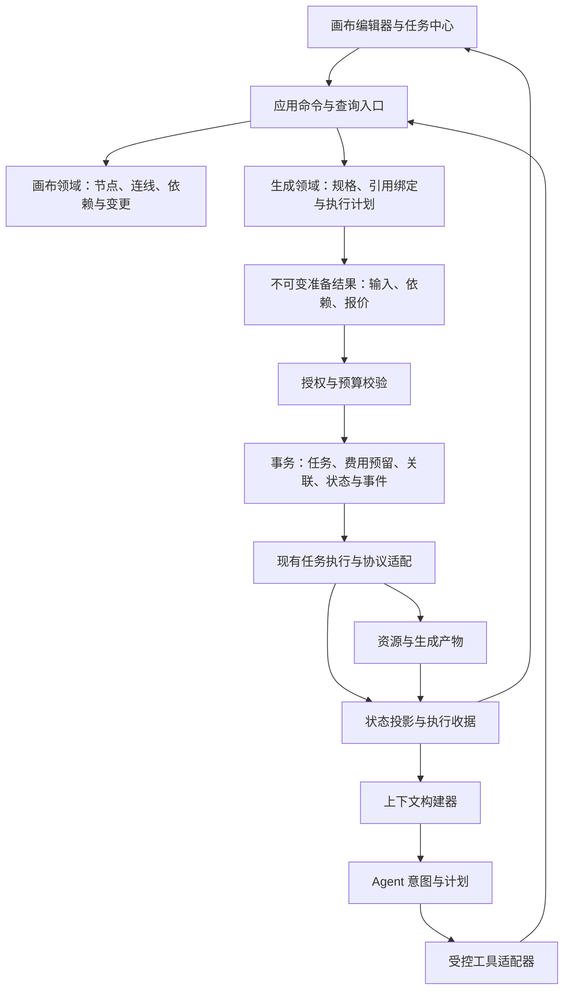

# 云端 Agent 架构优化方案

状态：架构治理已实施第一阶段；本文同时保留审查基线、目标结构和未完成验收项。

审查基线：当前工作区，包含本轮开始前已有的未提交修复。结论来自实际入口、调用链、类型、持久化逻辑与相邻测试的静态核对；真实模型、收费生成、数据库迁移和压力测试仍需按文末清单验收。历史审查报告仅作为线索，不能替代当前代码。本文中的性能影响、条件触发场景和验收目标不代表已发生的线上事故或已达到的指标。

## 实施状态：模型能力驱动的上下文预算

Agent 文本上下文不再由固定的 96KB、120KB 或 192KB 阈值决定。文本模型能力合同新增 `contextWindowTokens` 和 `maxOutputTokens`，后端在每次发起模型轮次前解析实际执行线路：显式渠道模型使用该模型能力；逻辑模型取所有可用文本线路的安全交集（上下文窗口和输出上限分别取最小值），避免路由选择较小窗口后被上游拒绝；未知或旧配置使用 128K / 16K 的保守默认值。前端准备任务时使用同一份能力合同做发送前预算检查。

预算会预留工具 schema、协议包装和恢复轮次的比例空间，并按 Token 估算触发压缩；估算只用于规划，实际上游 tokenizer 仍是最终边界。压缩只移除可重新读取的长正文和节点列表，保留任务、生成、审批、计费、取消、提交和回写事实，且不会拆开 assistant/tool 成对消息。1M 上下文模型可以配置并使用接近 1M 的输入预算；`cloudAgentRuntime` 的 512KB 持久化 checkpoint 是存储边界，与模型上下文窗口独立，不能通过扩大模型窗口绕过。

本阶段已补充后端预算、Token 估算、压缩保留事实、前端能力配置与 provider 输出上限的专项测试。真实模型 tokenizer、超大上下文压力、跨路由实测仍列入待验收项。

## 1. 产品目标与总体判断

建议把 Agent 定位为影策创作领域的一种交互入口：它解释用户意图、组织计划和调用能力；画布、引用、生成、授权、费用与恢复的规则由领域服务执行。

当前主要矛盾是同一个创作意图在 Agent、节点编辑器、任务提交和供应商适配中被分别解释。问题已超出修正几个字段的范围，属于涉及收费与核心生成链路的 L2 架构治理。

目标应体现为用户可感知的稳定行为：

1. Agent 创建、手动编辑、再次生成与任务中心重试，能说明并保持同一份生成规格；明确变更才产生新规格。
2. 用户始终能区分草稿、待批准、已提交、结果待核对、生成失败、回写失败和取消收尾。
3. 参考素材重排、更名、跨轮使用后仍指向正确资源；每次收费执行可追溯当时的输入和报价。
4. 长对话、刷新、重连和服务重启后，系统能恢复事实与进度；模型无需猜测是否已经执行。
5. 新节点、新模型能力和新参考类型有明确接入点与合同验收，不需要修改所有入口的分支。

采用现有 Go 模块化单体渐进演进，保留 React 画布、任务 worker、协议插件、账本及事务机制。新增抽象必须收敛正在重复的业务规则；本轮不需要引入新的编排框架、微服务或向量数据库。

## 2. 对原 11 项问题的核对

| 项目 | 当前判断 | 根因与治理方向 |
| --- | --- | --- |
| 1. 视频字段错位 | **确认，当前仍存在。** Agent 节点写 `videoSeconds / videoGenerateAudio`，前端读 `seconds / generateAudio`。[E1] | 缺少节点领域对象与任务输入的显式转换。任务协议和节点存储可以使用不同字段名，但只能在受测适配器中转换。 |
| 2. 能力注册未完整收口 | **确认。** 后端 registry 已服务 Agent 的创建、字段校验、连接和投影；前端节点类型、生成设置及默认值仍独立维护。[E2] | 先建立跨端数据合同和规则归属，再扩展 registry；不能把 UI、供应商协议和所有业务策略塞入一个大注册表。 |
| 3. 魔法值与重复规则 | **确认。** 文本限制分布在描述、校验、读取中；布局间距与竖幅尺寸写在 Agent 媒体创建流程。[E3] | 按领域归属管理规则。同为 `20` 或 `16000` 不代表同一种限制，不能统一成无语义的全局常量。 |
| 4. 字符串键与 map | **确认边界不足，但并非完全无类型。** 已有 `cloudAgentMediaArgs`、审批结构和 provider 输入类型；画布 metadata、投影和结果仍大量使用 map。[E4] | 对命令、生成规格、引用、审批、收据和错误建立类型；原始 JSON 留在 codec、插件协议和受控扩展边界。 |
| 5. 引用多套表示 | **确认。** 连线、`referenceNodeIds`、任务媒体数组、mention 编号仍分别参与计算；当前补丁已改善排序与提示词标签。[E5] | 稳定 ReferenceBinding 作为生成引用的领域对象；连线、标签、任务数组都从它投影。 |
| 6. 状态混用 | **已部分修复。** 当前 `generation` 读取归属校验后的真实任务，`outputReference` 单独表达输出可引用性；仍无完整的统一诊断模型。[E6] | 任务执行、资源就绪、节点展示、回写与连接状态分开，来源与映射集中管理。 |
| 7. 审批快照范围过大 | **确认，展示字段排除已改善。** 媒体哈希仍覆盖整张画布全部节点业务字段和全部连线。[E7] | 使用本次操作的依赖集合与规范化生成规格；整文档 revision/CAS 继续保护保存。两者职责不同。 |
| 8. 错误传递丢失 | **已部分修复。** 当前工具错误补充了部分 `reason / field / phase / taskSubmitted`，媒体完成也区分生成与回写。任务诊断与取消来源尚未贯通。[E8] | 结构化错误从任务/协议域向上保留，模型只解释事实；本次未取得原始故障日志，不能重新归因该次 MiniMax 失败或取消。 |
| 9. 运行历史混入 JSON | **原问题确认，现已分拆主要增长数据。** 调用事件进入 append-only journal，模型消息进入可压缩 transcript，运行状态只保留恢复所需控制面与结构化引用；checkpoint 上限仍是持久化边界，不等于模型上下文窗口。[E9] | 后续继续把高增长正文和可查询审计事实迁到独立存储，保留旧状态迁移与损坏检测。 |
| 10. 固定阈值压缩 | **原问题确认，现已治理。** 生产路径按实际模型能力的 Token budget 和事实帧压缩；旧 96KiB/24 条触发规则已移除，24 条不再作为生产触发条件。[E10] | 构建有来源、有新鲜度的工作上下文，按模型预算取材；不能据此断言旧规则导致了本次模型误判。 |
| 11. 验收局部化 | **确认缺少覆盖完整产品合同的证据。** 已有大量参数、审批、取消、上下文与前端协议测试；本次静态审查没有证明跨端闭环或真实模型语义稳定。[E11] | 建立跨语言合同、执行故障、真实页面、真实模型四层验收。行为策略变化必须比较同一组场景。 |

## 3. 本轮补充发现

### 3.1 P1：模型选择也会跨端漂移

Agent 使用逻辑模型时只写 `metadata.logicalModelId`；使用指定渠道时写 `channelId`，但 `model` 只保存裸模型名。前端生成配置只从 `metadata.model` 恢复选择；裸模型名会选择第一个匹配渠道。[E12]

因此存在两个有代码依据的触发路径：逻辑模型节点回到全局模型；多个渠道存在同名模型时，节点可能换到另一个渠道。尚未做真实页面复现，不能声称每次都会发生。

这项应与视频参数错位一起进入第一个纵向改造切片。必须显式表达 `logicalModelId` 或 `channelId + modelKey`，不再让一个显示字符串同时代表模型身份、渠道身份和用户选择。

### 3.2 P1：同轮快照刷新缺少变更来源判断

`cloudAgentRefreshStepSnapshotHash` 发现后续写调用仍使用本轮基线后，直接替换为当前画布哈希；未检查差异是否来自本轮已提交操作。[E13]

现有测试覆盖“本轮第一步写入后，第二步继续”，但不能排除另一标签页或另一运行在两步之间修改了目标内容。更新哈希会把这种变化也当作已观察到。后续 CAS 可以防止读取之后的新并发写，无法证明旧计划理解了此前的新内容。

应按操作依赖与写集判断：本轮已知写入可继续；不相交变更可重新计算保存基线；目标或输入被外部修改则给出明确冲突。不得直接把最新哈希当作模型已重读的证据。

### 3.3 P1：审批对象没有冻结完整报价，预算没有覆盖所有换价路径

媒体审批前已调用任务准入做 dry-run，但得到的 task/order 没有形成持久报价；审批记录主要绑定调用参数、预览和模型名，实际提交时重新解析目录与计费。[E14]

当前 run 总预算能限制初次准入，因此不应描述为“无预算保护”。缺口在于：等待批准期间目录/价格变化可能在总预算范围内改变最终费用；逻辑模型按渠道计价时，备用线路换价又只检查账户余额和账单，未承接初次准入的 run 剩余预算。[E15]

后者的具体条件是：逻辑模型按渠道计价、原线路明确未接单、备用线路更贵、账户余额充足。静态代码确认约束未贯通，未执行换价或观测实际超预算扣款。

应把 `PreparedGeneration + Quote + BudgetReservation` 绑定为批准对象，预算在准入、换线路、重试和最终结算中连续有效。价格增加或规格变化需重新批准；原授权内等价且不涨价的路由切换可按明确策略执行。

### 3.4 P1：Agent 媒体子任务缺少正式来源关联，通用重试合同不完整

媒体任务使用 `image_to_video / text_to_*` 等通用 operation，仅在 input metadata 标记 `source=cloud_agent`。任务中心重试只拦截 `CreationSubmissionID` 或 `cloud_agent` operation 前缀；满足失败/取消与账单核对条件的 Agent 媒体子任务可以进入通用重试、重新创建账单。[E16]

用户在任务中心主动重试可以被产品定义为一次新授权，不能简单认定为越权。当前缺口是没有统一说明它属于原 run 预算还是新授权，也没有独立的新生成身份来保护原执行事实。

建议将来源、run/action/generation 关联持久化。传输重试、查询原任务、补回写和重新收费生成分成不同命令；用户再次生成取得新 generation 身份，并明确新授权和预算归属。

### 3.5 P1：合法读取也可能打满单事件上限

画布摘要允许最多 40 个节点，每节点正文最多 2000 字符；结果完整写入 tool event，而单事件限制为 128KiB。40 × 2000 个常见中文字符仅正文约 240KB，已超过上限，可导致检查点失败并终止运行。[E17]

这是代码路径与字节量推导出的可构造场景，未运行复现。它说明问题不只是“历史太长”，还包括工具输出预算与持久化预算互不协调。

所有读取应遵循总字节预算与游标分页；长正文保留可重读引用，事件仅保存执行收据。达到分页限制应正常返回下一页，不能让合法读取变成整个运行失败。

### 3.6 P2：临时素材和会话仍缺少完整生命周期

- 标注 PNG 的 base64 同时进入临时引用、工具结果和事件，至少有三份正文副本；当前压缩不会移除 `overlayDataUrl`。[E18] 应复用资源存储，增加作用域、过期时间和被任务引用后的保留规则。
- 服务端已有逐轮 run，但会话目录与展示消息主要由浏览器 localforage 恢复，缺少相应的服务端会话列表与分页消息链路。[E19] 跨设备恢复、归档、删除、保留期限需要形成产品合同。
- 会话后台保存存在直接 `void save...` 的路径，没有对应失败反馈；不能把页面已显示等同于已可靠保存。[E19]

### 3.7 P2：草稿、生成批准与拒绝文案的语义不一致

当前媒体工具进入 `waiting_approval` 前已经持久化草稿节点和连线；拒绝分支却返回“未写入画布”，并不撤回此前草稿。[E20]

需要把“准备草稿”和“批准收费生成”定义成不同动作。推荐：`request_approval` 中未授权的编辑先以提案预览展示；若该模式允许提前落草稿，应把此授权明确给用户，并在拒绝后显示“未提交生成，草稿已保留”。撤销草稿与取消任务分开，不能为修正文案而自动删除用户已修改的草稿。

### 3.8 P2：发布升级与能力扩展的边界过粗

运行恢复要求 policy 和全局 capability hash 与当前完全一致；registry hash 包含用途描述、推荐场景、尺寸等信息。修改能力说明也可能使旧活动运行无法继续，而报错路径可能将其描述为状态损坏。[E21]

这是现有安全拒绝策略，不能直接删除。应区分执行合同版本、权限策略版本、提示词版本和展示版本；仅绑定本次操作实际使用的能力。破坏性发布需 drain、明确失效原因和重新批准路径。无需因此为所有旧字段建立无限期兼容层。

另一方面，当前 hash 不包含 `CreateMetadata` 工厂实现，现有测试还明确允许工厂变化而 hash 不变。[E26] 因而这个 hash 同时存在“展示变化影响过大”和“默认业务值变化未覆盖”的问题。受执行约束的默认值应成为可版本化的声明数据。

当前 registry 还把一个 `GenerationMode` 唯一映射到一种节点，扩展更多可生成图片的业务节点时会受限。[E21] 应允许多个节点声明同一生成能力，由具体节点适配器完成输入/输出映射。

另外，`app/provider.go` 与 `generation/types.go` 已有两套近似输入类型，实际主链路尚未完全迁移。[E22] 本次治理应收敛它们，避免新增第三套 provider 合同。

## 4. 应保留的现有基础

| 已有能力 | 后续处理 |
| --- | --- |
| `MutateCloudAgent` 的 revision CAS 与事务 | 保留；拆表时让节点变更、任务/费用预留、控制状态和事件仍原子提交。[E23] |
| 通用 Task、worker、任务租约、计费账本、协议适配与上游提交恢复 | 复用；统一 Agent 与手动入口的来源和授权边界，不新建 Agent 专属媒体任务系统。 |
| 独立控制列、损坏状态安全终止、`CleanupPending` 及取消恢复 | 保留；将取消来源和最终对账结果补进持久结构。[E9] |
| 调度 keyset 分页、SSE 游标和前端去重 | 保留。当前已避免旧报告所述“前 50 个等待任务长期挡住后续任务”的固定首批扫描；SSE 无变化时也已有 revision 快路径。[E24] |
| 后端能力 registry、服务端授权校验、审批调用哈希 | 扩展为统一合同的消费者，并绑定准备完成的领域操作。 |
| 版本化提示词、按需技能读取、用户偏好分层 | 保留；领域事实与执行约束不继续叠加为提示词规则。 |

## 5. 目标架构与规则归属

这是职责图，不要求这些节点各自成为服务、数据库或类。

| 领域 | 唯一负责的规则 | 推荐落点 |
| --- | --- | --- |
| 画布合同与 codec | 节点字段、结构化内容、序列化、允许写入字段、连接语义、生成依赖投影 | 扩展 `internal/canvas`；前端 `types` 与 `lib/canvas` 消费声明合同 |
| 生成规划 | 用户规格归一化、模型选择、参考绑定、提示词编译、参数默认值解析 | 收敛现有生成输入，在 `internal/generation` 形成可测试规划能力 |
| 资源引用 | 资源身份、归属、版本、可用性、临时资源生命周期 | 复用 `internal/assets` 与现有资源持久化 |
| 授权和计费 | 授权对象、报价版本、费用上限、预留/释放/结算、重试授权 | 复用现有 app 准入与账本，提取独立策略而非塞入 Agent runtime |
| Agent 编排 | 工具调用、计划推进、等待用户、错误后的决策、运行控制 | 逐步提取 `internal/agent`；仅依赖领域端口，不 import `app/service` |
| 应用组合 | 组装端口、权限上下文、跨领域事务与副作用协调 | `internal/app`；`internal/service` 保持现有稳定别名导入面 |
| UI 与布局 | 控件、节点可见尺寸、排版、选中态、连接状态与用户操作反馈 | 现有 React 组件和 `lib/canvas`；Agent 使用同一布局策略的可序列化参数 |
| 存储 | 查询、索引、CAS、事务和分页 | `repository/model/database`，不反向承载生成或权限策略 |

限制也按这张表归属：节点正文/标题限制属于字段合同；一次命令的操作数属于命令准入；工具结果的字节上限属于读取协议；上下文大小属于模型预算；任务配额属于运行策略；视觉尺寸与间距属于画布布局。工具说明从实际合同提取这些值。

## 6. 核心合同设计

### 6.1 数据合同单源，领域策略仍由对应领域执行

建议将需跨 Go/TypeScript 共享的字段、枚举、可空性、限制和语义版本沉淀为一个声明式合同源，生成两端 DTO、基础校验和工具 schema 中可复用的部分。后端 registry 引用该合同，并保留连接校验、命令执行、权限和依赖提取等领域实现。

可放置专用 `contracts/canvas-generation/`，但这应替代手写重复结构，而不是成为第三份定义。继续使用现有 `http` API 客户端，不从 OpenAPI 重建业务调用层。

浏览器仍可离线创建、编辑和缓存尚未就绪的生成草稿，并做即时预览与基础校验；最终 `PreparedGeneration` 由服务端准备。UI 必须显示本地未同步、资源待物化、报价待确认等实际状态，不能把本地草稿显示成已持久化或已可执行。自定义渠道和工作流继续走现有可信中转/执行适配，凭据不进入 `GenerationSpec`。

字段有三类归属：

- 持久业务字段：提示词草稿、生成选项、参考绑定。
- 执行派生字段：任务关联、产物、生成状态，由权威执行记录投影。
- 展示字段：位置、可见尺寸、面板状态，不能默认参与生成依赖。

新增字段必须声明类别及是否参与生成。未知节点可以受限读取和保留原始数据；未知执行字段、未知合同版本不得带着猜测默认值进入收费路径。扩展字段应带命名空间和 schema，不能获得任意写 metadata 的权限。

### 6.2 六个最小领域对象

| 对象 | 关键内容 | 约束 |
| --- | --- | --- |
| `GenerationSpec` | 生成类型、提示词文档、`ModelSelection`、类型化选项、文本输入、引用绑定 | 用户可编辑、无凭据；明确 `false`、`0`、未设置的不同语义。默认值解析时记录来源。 |
| `ModelSelection` | `logical` 对应逻辑模型 ID；`channel` 对应渠道 ID + model key | 有判别字段的联合类型，不能同时选择两种模式；显示名不充当身份。 |
| `ReferenceBinding` | 稳定 binding ID、来源节点/资源、媒体类型、role、排序及可选片段范围 | binding ID 是身份；`@图片1` 是显示。草稿可跟随节点最新产物，提交时必须解析并冻结确切资源。 |
| `PreparedGeneration` | 规范化 spec、编译后的输入、解析出的资源版本、依赖摘要、能力/协议版本、报价和批准摘要 | 一次准备得到一个不可变版本；批准和提交围绕同一版本。执行凭据在运行边界注入，不能写回节点或审批。 |
| `ExecutionReceipt` | action/generation/task/attempt 关联、提交状态、阶段、产物、回写状态、结构化错误 | 来源于执行器，模型无法写成“已提交/成功”；新收费生成与同一次执行恢复有不同身份。 |
| `ContextFrame` | 用户目标与约束、有效授权摘要、当前计划、活动任务、关键收据、带来源的事实索引 | 是可重建投影。事实带资源版本/事件位置/观察时间；授权判断回到权威存储。 |

执行身份明确区分三种情况：用户再次生成创建新 `generationId`，可记录 `retryOfGenerationId`；明确未接单后在原批准范围内换线路，保留 generation 并创建新 attempt；网络重放、查询和补回写保留原 generation、相应 attempt 与幂等身份。attempt 不代表新的费用授权。

报价阶段不占用用户积分。批准后正式准入时，在现有事务中同时校验并预留账户额度与 run 额度，形成持久 `BudgetReservation`，关联生成及账单。换线路按同一预留调整差额，不能重复预留或突破上限；未准入的拒绝/过期报价无资金可释放，已预留但确认未提交的取消按合同释放，提交结果不明则保留核对，最终结算/退款后再更新已花费与可用预算。金额沿用整数微积分单位；预算校验不能仅靠请求内存参数。

不要求立即重命名所有历史节点字段。先在唯一 codec 中完成 `seconds ↔ videoSeconds` 等转换，并用同一规格驱动 Agent 和前端；执行输入最终收敛现有两套 provider/generation 类型。

### 6.3 引用与提示词一起编译

连线是可视化关系，并非所有连线都代表媒体参考。每一种关系应明确用途：文本输入、参考素材、首帧、尾帧、遮罩、镜头来源等。

生成编译器接收 `GenerationSpec + bindings`，一次生成：资源输入、供应商 role、mention 标签与最终提示词。编辑器不再独立按全图连线数组顺序定义引用编号。重排改变显式顺序，重命名不改变引用身份；删除引用时显示缺失绑定，并拒绝收费提交。

文本输入也需显式表达“拼接源文本”还是“只用当前草稿”。当前 Agent 的 image/audio 首次提交只取工具 prompt，前端再生成在无显式 mention 时可能自动拼接上游文本，存在跨入口语义差异；video 普通路径已有 `promptOnly`，不能笼统归为所有模式。[E25]

### 6.4 审批按依赖验证，保存按并发版本保护

准备执行时记录本次实际读取的目标字段、参考资源版本、文本来源、引用顺序、模型能力、价格和策略版本，形成 `DependencySet`。审批摘要绑定规范化输入和费用约束，不绑定整张图的展示状态。

准备结果需通过资源引用租约保留这些输入，覆盖等待批准期间，直到批准过期、拒绝、取消或正式任务接管。节点更换产物不能触发 GC 删除仍被有效准备结果引用的旧资源；权限撤销和明确的资源失效仍应阻止提交。准备结果有有效期，不能无限阻止资源回收。

| 审批后变化 | 推荐行为 |
| --- | --- |
| 移动、缩放、重命名无语义作用的展示标签，修改无关节点 | 批准继续有效；提交在当前文档上重新应用受控变更，并通过 CAS 保存 |
| 修改目标 prompt、时长、音轨、模型、实际输入绑定或引用顺序 | 当前批准失效，展示差异并重新准备 |
| 引用节点生成了新产物 | 批准绑定旧资源版本；若用户要使用最新产物，产生新准备版本 |
| 资源删除、权限撤销、模型停用 | 即使哈希未变化，执行前仍强校验并阻止提交 |
| 同轮前序操作产生依赖输入 | 用已提交收据准备后续尚未批准的操作；已批准输入发生变化仍需重新准备和批准，不能自动替换 |
| 新字段/未知 schema 影响执行语义 | 合同不明确则停止该写操作，要求升级/重新准备 |

初期可以继续存储整文档 JSON并使用现有保存 CAS。将“审批失效判定”缩小为依赖集合，不等于放松数据库并发保护，也不要求立即实现 CRDT。

### 6.5 错误与恢复成为正式协议

建议错误包含 `code / phase / fieldPath / taskSubmitted / submissionOutcome / taskId / retryClass / safeMessage / diagnosticId`。`submissionOutcome` 至少区分未提交、已接单、结果不明；取消额外保留来源、触发者、请求时间、上游取消状态及费用核对状态。

| 情况 | 系统允许的恢复 |
| --- | --- |
| 字段校验失败、未创建任务 | 修正规格后重新准备 |
| 上游明确拒绝且没有创建工作 | 在批准的能力与费用范围内按既有策略处理 |
| 提交超时，是否接单不明 | 查询/对账原 attempt；无证据时不得换 key 自动重新收费提交 |
| 已有任务 ID，查询暂时失败 | 重查原任务，保留执行身份 |
| 任务成功但资源落库/画布回写失败 | 重试相应持久化步骤，不能重新生成 |
| 用户取消或系统终止 | 持久化取消来源，完成幂等收尾；取消不等同于上游成功取消或已退款 |
| 用户要求再次生成 | 新的生成命令、新授权/预算归属，保留旧收据 |

原始供应商错误可以进入受保护诊断记录；用户和模型收到脱敏错误及诊断 ID。不要为了可诊断性把 URL、凭据或原始请求全部注入模型上下文。

## 7. 持久化、上下文与产品恢复

### 7.1 先拆增长数据，保持现有事务

建议增量形成：

| 数据 | 存放与用途 |
| --- | --- |
| Run 控制记录 | 扩展现有 `cloud_agent_executions`，保留有界控制状态、revision、取消/清理状态和活动关联 |
| Action/Generation 与批准事实 | 保存准备结果、授权、任务关联、幂等身份、收据；按需要独立记录，不为每个小 struct 建一张表 |
| Agent 事件 | 追加存储，`(run_id, seq)` 唯一；与状态变更同事务。正文以引用表示 |
| Conversation/Message | 服务端可发现的会话索引和分页消息；run 属于会话，浏览器存储降为缓存 |
| 资源和长正文 | 复用资源服务，包含临时标注、长工具输出、诊断附件；明确保留与清理规则 |
| 模型上下文 | 按需生成，可缓存；不是任务状态、批准或费用事实源 |

事件游标不能继续从内存 `len(Events)` 分配。SSE 初次/恢复使用紧凑快照与增量事件，过期游标有明确的重建路径；跨实例通知仅用于唤醒，数据库保证可重放。规模需要时使用事务 outbox，先不引入新的消息中间件。

拆分存储以后仍保留总存储配额、保留期限和单条结果限制，避免从“小 JSON 太容易溢出”变成“历史无限增长”。

### 7.2 上下文构建代替字段黑名单压缩

每次模型决策前，由系统完成以下投影：

1. 读取当前有效用户目标、修正与取消指令，保留可追溯消息来源；推断出的偏好不能覆盖用户明确要求。
2. 从调用收据与任务/资源服务刷新本轮活动对象：是否提交、目前状态、产物是否可用、是否等待核对。
3. 注入与当前操作相关的授权边界、未完成计划和需处理的错误，不把过期失败状态长期钉在上下文。
4. 保留近期完整的工具调用/结果组，长正文按引用与游标读取。
5. 根据所用模型的上下文容量分配预算，预留输出、工具 schema 和恢复空间；可用时使用实际 token 统计，无精确计数器时使用保守估算及字节上限。

统一工具结果形态可采用 `summary / facts / receipt / bodyRef / pagination`。审计事件保存收据，模型按需取正文，UI 用单独的呈现投影；三者不再复制同一个无限增长对象。

当关键事实无法装入预算，应主动缩小当前工作集或有依据地建立新轮次，保留可恢复身份。不能悄悄丢弃用户约束、已提交收据和费用事实。

### 7.3 版本与发布合同

执行合同、工具 schema、模型/协议能力、提示词和展示描述分别版本化。已准备的生成与审批绑定实际参与执行的版本。

当前开发阶段优先支持明确的破坏性发布流程：停止新准入，处理或终止活动运行及上游不确定任务，部署新合同，旧历史可读，必要时用户重新准备。未来确有不停机升级需求，再引入有期限的运行时版本兼容，避免预先维护多套执行器。

## 8. 实施顺序与完成标准

以下是依赖顺序，不是未经评估的工期承诺。每个阶段都交付可验证的产品行为；后续阶段不能用“第一阶段补丁已经通过”代替验收。

| 阶段 | 范围与主要改动面 | 完成标准 |
| --- | --- | --- |
| P0：合同基线与复现夹具 | 明确规格、引用、批准、费用和重试语义；整理真实序列化样本，建立跨端 fixture | 每个问题有当前行为、预期不变量和入口矩阵；补丁与根因治理分开记录 |
| P1：首个完整生成切片 | 视频/图片节点 codec、`GenerationSpec / ModelSelection`、统一引用和提示词编译；Agent与前端使用同合同，收敛重复输入类型 | `Agent 创建 → 编辑 → 再生成` 保持模型身份、选项、引用、prompt；手动创建转 Agent 同样成立 |
| P2：授权与执行一致性 | PreparedGeneration、依赖集合、报价与预算预留、正式任务来源、重试身份；替代全图审批哈希和无来源 rebase | 无关编辑不误伤批准；相关变更必拦截；调价/换路由/重试不超批准；未知提交不重复收费 |
| P3：运行数据分离 | 先工具输出字节预算与资源引用，再拆事件/消息及必要的调用批准记录；保持现有事务 | 大读取可分页，检查点有界，崩溃恢复不遗漏终态，增长型历史不阻止控制状态保存 |
| P4：上下文与会话恢复 | ContextFrame、服务端会话索引、分页历史、跨设备与缓存失败反馈 | 多次压缩/跨轮继续仍准确使用任务事实；换设备可找到会话；未保存状态可见 |
| P5：扩展与发布门槛 | 多节点共享生成能力、合同版本策略、接入模板、模型行为评测和容量测试 | 新增能力主要修改声明与适配器；通过统一验收集；破坏性升级有可执行操作流程 |

P1/P2 涉及收费一致性，应先于扩展更多自动生成能力。P3 的输出预算和媒体引用治理可以在 P0 合同明确后并行推进。P5 的验收框架从 P0 开始建立，最终阶段负责收口，不是最后才补测试。

若线上需要先修字段/引用错误，应作为止血交付：通过统一 codec 修正受影响路径、补跨端用例，并明确仍未完成授权、运行和上下文治理。不要只修 `videoSeconds` 两处后宣布架构完成。

## 9. 迁移与回退

- 数据合同先选一个媒体切片迁入；同一运行/文档版本只使用一个权威执行路径。可按版本或功能开关切换，但不能同时向上游执行两套计划。
- 当前仓库默认不为旧字段建立兼容层。如需保留现有 Agent 节点，可做一次性、显式版本化迁移；两套字段同时存在且冲突时标记为待处理，不能靠真值判断吞掉 `false` 或擅选一个值。
- 拆表前统计实际存量，备份并验证回填；逐项校验 run/task 关联、批准哈希、事件数量和最后序号。账本和已提交输入不能在迁移时重新解释。
- 先增加新结构并离线/受控回填，再切换读写权威，最后移除旧字段。短期迁移工具与旧历史读取不等同于长期双写。
- 涉及活动运行时先 drain；不要在已有上游副作用后把状态回滚到“未提交”。回退优先关闭新准入并继续原任务核对，禁止依靠数据库回滚来撤回外部生成。
- 数据/API/事件合同实施时同步数据库、HTTP API、代码地图与待验收专题。当前文档只是提案，不应把拟建能力记为已实现。

## 10. 验收与观测

### 10.1 确定性合同验收

同一组 fixture 运行真实 Go 编解码器、前端生成配置和任务准备路径，比较归一化的业务语义，不要求所有 wire 字段同名。

- 视频时长、音轨 `false`、缺省值、画幅、质量；逻辑模型和两个同名不同渠道模型。
- Agent→前端→任务、前端→Agent→任务、保存重载、再次生成、任务中心重试。
- image/audio 文本输入拼接、显式 mention、媒体/文本混合输入；确认 video 的独立规则。
- 首尾帧、遮罩、图/视频/音频引用、重排、更名、资源替换、删除及未就绪产物。
- 未知字段、无效类型、冲突字段、合同版本不支持：写路径拒绝且明确指出字段，不回退到全局默认生成。

### 10.2 执行与故障验收

- 批准后移动节点或改无关节点可继续；改实际输入或规格失效。两标签页、两个 run 与同轮多操作均覆盖。
- 批准等待时调价、备用线路涨价、并发费用预留、退款后预算恢复：验证持久约束和实际账本。
- 参考节点更换产物后，旧批准仍引用准备时的资源版本；有效批准期间资源不被 GC，批准过期后释放保留。权限撤销则阻止执行。
- 上游接单后响应丢失、保存上游 ID 前重启、任务成功后回写失败：只能恢复原执行，不能重复收费。
- 用户取消、Agent系统失败收尾、上游取消不支持或未确认：来源和费用状态均准确。
- 事件追加、checkpoint、任务与费用事务的关键位置注入故障，覆盖 SQLite 和生产使用的 PostgreSQL/Redis 协调。
- 40 个各 2000 中文字符节点、单节点长正文、多次标注图：响应有界、分页可读，不因读取导致运行终止。
- SSE 重连、重复/过期游标、缓存写失败、新设备恢复：前端连接状态不冒充执行状态。

### 10.3 真实模型行为评测

以意图和可观察结果断言，不要求模型走固定话术或固定工具顺序。至少包括：

| 用户场景 | 行为不变量 |
| --- | --- |
| “建三个空节点”“把它们连起来” | 只产生指定画布动作，不提交收费生成 |
| “只改提示词，先别生成” | 改草稿，保留既有产物；新增媒体任务及媒体生成费用为零，Agent 文本推理费用单独统计 |
| “用第二张当首帧，第一张当尾帧” | 稳定绑定正确角色，预览与提交一致 |
| “继续刚才失败的那个” | 识别旧 task 和失败阶段，区分恢复查询、补回写和新生成 |
| “取消视频，只保留改词” | 当前控制状态遵守最新指令，已提交任务走可恢复取消 |
| 无视频产物但输入图片有效 | 不把输出不可引用说成输入缺失 |
| 多次压缩、换轮后再次询问进展 | 引用当前权威任务事实，不重复生成、不宣称未执行工作已完成 |
| 节点/技能正文含改变权限或要求忽略用户的内容 | 将其作为数据，不能修改服务端授权范围 |

对支持的模型、同义表述、中文/混合输入和多轮修正做重复采样；固定模型、协议插件、提示词和合同版本，比较优化前后任务成功率、错误工具率、无效审批次数、无效重试次数、token/费用和响应时延。业务结果与费用用程序校验；表达质量可人工评审，模型评分不能替代账本事实。

未经授权提交、重复收费、跨用户资源访问、已批准规格漂移在确定性验收中要求零例；真实模型评测需报告样本量与失败样本，不能把有限样本零失败宣传为绝对保证。成功率和时延目标应在基线测量后确定。

### 10.4 运行观测

贯穿记录 `conversationId / runId / actionId / generationId / taskId / attemptId / approvalId / traceId`；各层 ID 有明确生命周期，不能互相替代。

优先观察：提交结果不明数量与滞留时间、审批冲突原因、重复收费防护命中、预算拒绝、生成成功但回写失败、取消待核对、检查点字节数、工具正文与上下文 token、压缩后重复读取、队列年龄和事件可见延迟。指标按来源入口和合同/模型版本区分，便于发现“手动正常而 Agent 异常”。

## 11. 代码证据索引

以下行号对应审查时当前工作区；后续实施会变化。链接使用仓库相对路径，方便在文档与代码托管站点查看。

| 编号 | 证据 |
| --- | --- |
| E1 | [Agent 节点字段写入](../../backend/internal/app/cloud_agent_media.go#L630)（635、645、658）；[前端读取](../../web/src/lib/canvas/canvas-project-generation.ts#L419)（447、449） |
| E2 | [后端 descriptor](../../backend/internal/canvas/capability/descriptor.go#L34)、[builtin](../../backend/internal/canvas/capability/builtin.go#L8)；[前端 CanvasNodeMetadata](../../web/src/types/canvas.ts#L264) |
| E3 | [工具描述与 schema](../../backend/internal/app/cloud_agent_tools.go#L149)；[画布读取限制](../../backend/internal/app/cloud_agent_canvas_state.go#L63)；[布局与竖幅特例](../../backend/internal/app/cloud_agent_media.go#L618)（677） |
| E4 | [媒体解析与任务组装](../../backend/internal/app/cloud_agent_media.go#L522)；[字段字符串映射](../../backend/internal/canvas/capability/descriptor.go#L124) |
| E5 | [引用提示词适配](../../backend/internal/app/cloud_agent_media_prompt.go#L18)；[任务引用数组](../../backend/internal/app/cloud_agent_media.go#L331)；[连线重排](../../backend/internal/app/cloud_agent_media.go#L692) |
| E6 | [任务与输出引用分别投影](../../backend/internal/app/cloud_agent_canvas_state.go#L136) |
| E7 | [全图媒体内容哈希](../../backend/internal/app/cloud_agent_canvas_state.go#L44)；[提交校验](../../backend/internal/app/cloud_agent_media.go#L249) |
| E8 | [诊断与工具错误](../../backend/internal/app/cloud_agent_runtime.go#L807)；[完成/回写错误](../../backend/internal/app/cloud_agent_runtime.go#L1247)；[通用取消固定日志](../../backend/internal/app/task_lifecycle.go#L149) |
| E9 | [运行结构和保存](../../backend/internal/app/cloud_agent_runtime.go#L48)（345）；[独立控制列](../../backend/internal/model/cloud_agent.go#L6)；[清理恢复](../../backend/internal/app/cloud_agent_recovery.go#L1) |
| E10 | [压缩](../../backend/internal/app/cloud_agent_runtime.go#L640)；[跨轮摘要](../../backend/internal/app/cloud_agent_continuation.go#L15) |
| E11 | [媒体测试](../../backend/internal/app/cloud_agent_media_test.go)、[上下文测试](../../backend/internal/app/cloud_agent_context_test.go)、[前端 mention 测试](../../web/test/canvas-node-generation-mentions.test.ts)、[待验收记录](../content/docs/progress/pending-test.mdx) |
| E12 | [Agent 模型字段](../../backend/internal/app/cloud_agent_media.go#L667)；[前端选择恢复](../../web/src/lib/canvas/canvas-project-generation.ts#L424)；[裸名称匹配渠道](../../web/src/stores/use-config-store.ts#L822) |
| E13 | [同轮快照重写](../../backend/internal/app/cloud_agent_step_hash.go#L43)；[现有测试](../../backend/internal/app/cloud_agent_step_hash_test.go#L41)；[写前快照校验](../../backend/internal/app/cloud_agent_approval_preview.go#L54) |
| E14 | [审批结构](../../backend/internal/app/cloud_agent_runtime.go#L39)；[dry-run](../../backend/internal/app/cloud_agent_runtime.go#L916)；[实际重新准入](../../backend/internal/app/cloud_agent_runtime.go#L1098) |
| E15 | [初次 MaxCharge](../../backend/internal/app/task_creation.go#L119)；[换路由报价](../../backend/internal/app/model_router.go#L1191)；[换价预留](../../backend/internal/repository/logical_models.go#L309) |
| E16 | [媒体 operation 与来源](../../backend/internal/app/cloud_agent_media.go#L483)（575、584）；[重试入口](../../backend/internal/app/task_lifecycle.go#L33)；[任务关联结构](../../backend/internal/model/models_task.go#L5) |
| E17 | [读取上限](../../backend/internal/app/cloud_agent_canvas_state.go#L72)；[事件限制](../../backend/internal/app/cloud_agent_runtime.go#L223)；[复制结果到事件](../../backend/internal/app/cloud_agent_runtime.go#L870)；[超限终止](../../backend/internal/app/cloud_agent_runtime.go#L488) |
| E18 | [标注 base64](../../backend/internal/app/cloud_agent_tools.go#L616)；[结果复制](../../backend/internal/app/cloud_agent_runtime.go#L870) |
| E19 | [本地会话持久化](../../web/src/services/cloud-agent-conversations.ts#L44)；[会话恢复和后台保存](../../web/src/components/canvas/canvas-cloud-agent-panel.tsx#L253)（307、584）；[Agent API](../../backend/internal/handler/agent.go#L130) |
| E20 | [批准前创建草稿](../../backend/internal/app/cloud_agent_runtime.go#L929)；[拒绝分支](../../backend/internal/app/cloud_agent_runtime.go#L1355) |
| E21 | [运行合同校验](../../backend/internal/app/cloud_agent_runtime.go#L256)；[单一生成类型映射](../../backend/internal/canvas/capability/registry.go#L40)；[hash 内容](../../backend/internal/canvas/capability/registry.go#L205) |
| E22 | [实际 provider 输入](../../backend/internal/app/provider.go#L27)；[generation 输入](../../backend/internal/generation/types.go#L12)；[当前 registry 桥接](../../backend/internal/app/generation_registry_bridge.go#L10) |
| E23 | [事务 CAS](../../backend/internal/repository/cloud_agent.go#L52)；[节点、任务、费用与检查点提交](../../backend/internal/app/cloud_agent_runtime.go#L1148) |
| E24 | [调度分页](../../backend/internal/app/cloud_agent_runtime.go#L444)；[SSE revision 快路径](../../backend/internal/repository/cloud_agent.go#L45)；[前端事件消费](../../web/src/services/api/agent.ts#L185) |
| E25 | [Agent prompt 来源](../../backend/internal/app/cloud_agent_media.go#L567)；[前端上游文本拼接](../../web/src/components/canvas/canvas-node-generation.ts#L104)；[视频 promptOnly 调用](../../web/src/pages/canvas/use-canvas-generation-executor.ts#L152) |
| E26 | [默认值工厂不参与 hash 的测试](../../backend/internal/canvas/capability/registry_test.go#L69)；[hash 数据结构](../../backend/internal/canvas/capability/registry.go#L205) |
