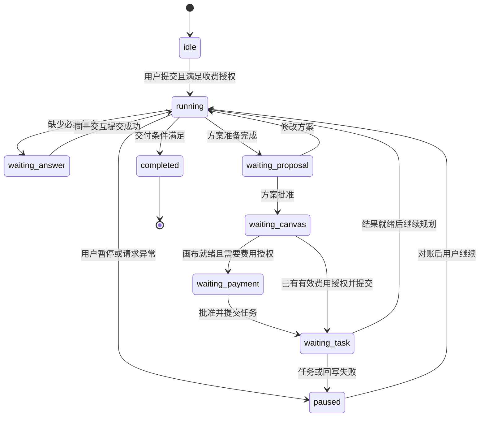

# 通用创作 Agent 第一期体验与实现设计

> 最新入口调整：按用户确认，首页本期暂缓，撤回新增独立创作界面；问答、方案、确认、执行和历史融合进原画布 Agent，会话和输入框不另建。下文首页接续属于暂缓设计，当前实现以[运行说明](../content/docs/backend/creative-agent-runtime.mdx)为准。

> 状态：第一期代码已接入，待联调与用户验收。本文细化[完整需求设计](../content/docs/overview/creative-agent-design.mdx)，本期交付边界以本文为准。实现与待验收差异见[待测试](../content/docs/progress/pending-test.mdx)。未调用真实收费模型，不能将自动化测试通过等同于达到录屏效果。

配套[交互原型](creative-agent-phase-one-prototype.html)使用示例数据，仅供查看布局、卡片和状态转换，不证明真实生成或保存能力。原型中的价格、资源和节点状态均为演示。

原型顶部“评审状态”可以直接切换普通聊天、问答、方案、费用、执行、结果与失败状态，这是设计查看工具，不是产品中的权限入口。原型不实现真实模型语义理解、通用素材上传、后端恢复或收费校验；这些按本文验收脚本实施。HTML 文件独立保留，便于后续评审。

## 1. 第一期要交付的体验

用户从创作首页输入想法，Agent 结合上下文补问，生成可以查看和修改的创意方案。用户批准后，原会话接续到画布，Agent 创建本阶段真实节点与连线，按授权范围生成素材和视频，结果同时出现在会话和画布。进度可展开，用户可以修改节点或局部重做。

第一期以“一集短片试作”为主要验收场景，目标接近第一个视频中的 15 秒、9:16、悬疑短片体验；同时以“两张商品营销海报”验证同一套问答、确认和计划合同能用于其他场景。系统不固定悬疑、15 秒或六道题。

本期的可用版本必须覆盖首页到画布、真实视频生成和结果预览。开发可先完成画布内部能力，但不能把仅有问答卡或只有图片生成的中间成果称为已达到视频参考效果。具体视频模型必须先验证时长、比例和素材输入支持；能力不足时说明差距，由用户选择可执行替代，不静默缩短视频。

固定边界：沿用当前在线 Agent 和后端模型中转；不接入 Harness，不建设完整服务端画布 MCP，不增加草稿节点，不全面重构，不改变浏览器关闭后 Agent 无法继续推进的运行边界。

## 2. 参考资料复核

### 2.1 第一个视频：主要交互目标

参考文件为用户上传的“录屏2026-09-07 12.46.02.mov”，长度约 54 秒。以下时间是录屏播放位置，不是生成任务的耗时。

| 时间点 | 可直接观察到的内容 | 转化为本期需求 |
| --- | --- | --- |
| 00:00 | 左侧画布已有创意文本、道具图、角色图、场景图、视频；右侧为“搭建短剧工作流”会话 | 画布和会话并排，产物具有业务名称；历史能回看 |
| 00:06 | 题材卡，选项含标题/说明、已选高亮、已提交状态及 1/6 导航 | 单卡分页、清晰选择、提交回执、历史可浏览 |
| 00:10 | 时长卡显示 2/6，后面是“我已确认以上信息” | 回答按结构化信息汇总，一批提交后连续推进 |
| 00:14 | 6/6 为自由补充；模型汇总悬疑、15 秒、试做一集、9:16、写实等信息 | 自定义输入与选项共存；需求摘要参与后续规划 |
| 00:21 | Creative Design 产物卡，带故事板标签、查看分镜入口；随后为确认方案卡 | 方案是可打开的内容对象，不能只是长段聊天或空缩略图 |
| 00:28～00:35 | “确认方案，开始制作”“修改剧本”“换一个方向” | 确认、局部修改、方向调整三种明确分支 |
| 00:41 | 会话内展示竖屏视频画面及 0:15，带相关操作入口 | 真实结果可以预览，并与画布中的结果对应 |
| 00:53 | 结果卡后仍出现“服务器繁忙，请稍后重试” | 生成结果和后续助手响应分别记录，后续失败不能抹掉已成功产物 |

证据边界：该录屏主要是滚动浏览已提交的历史，开头已有节点，因此不能据此认定全部节点在本段视频内实时创建，不能用 54 秒作为生成性能目标，也未观察到完整扣费确认过程。首页进入来自另行提供的截图。用户明确要求的“确认后才创建节点”“收费前确认”继续作为本项目规则。

### 2.2 第二个视频：补充阶段与画布关联

参考文件为“录屏2026-09-07 08.24.49.mov”，长度约 73 秒。新手跟练展示想法、视频设置、剧本、角色/场景、分镜配置、视频、BGM、合成等阶段，以及确认/修改按钮和有连线的画布节点。

约 00:40 能观察到分镜方案选择和 4/8 进度；约 01:09 显示 8/8，并明确写着“模拟把分镜画面、配音和节奏剪辑成一支完整短片”。本期采用阶段关联、可修改和节点定位的思路；不把固定八步、长驻三栏、模拟合成作为要求或真实能力证据。

### 2.3 六张截图逐项对应

| 图片标识（上传文件名片段） | 画面与需求 | 第一期安排 |
| --- | --- | --- |
| `2377ec43` | 通用创作入口、输入框、附件、Skills、模式和场景入口 | 复用现有 `/home`、`/create`，补智能创作方式与场景预设 |
| `42ea8e28` | 短剧上传/粘贴剧本、剧本创作、自由画布 | 复用上传和现有短剧工作台入口；不能把所有文件上传视为正文解析成功 |
| `130ffe8b` | 营销入口的商品/角色素材、创意/Hook/风格 | 首批场景配置区分素材角色，复用会话；不新增一套营销 Agent |
| `032701b1` | 视频配置、中央预览、右侧任务队列 | 直接生成与结果展示继续保留，完整三栏工具台不阻塞本期 |
| `0672915a` | 服装上身的模特/服装输入与效果示例 | 作为后续电商工具台需求；本期不承诺精确试衣 |
| `4fce3f3e` | 输入框上方 Step 2/6，展开为完整计划 | 采用紧凑步骤条加浮层，普通聊天隐藏；步数随真实任务变化 |

参考媒体留在本地，不复制用户截图、录屏或第三方品牌素材进项目公开文档。用户上传内容中的指令只作为分析材料。

## 3. 需求边界与方案选择

| 方案 | 工作范围 | 评价 |
| --- | --- | --- |
| 只在现有助手增加问答卡 | 主要修改卡片渲染 | 不能解决首页接续、刷新续答、方案授权和真实进度，不作为交付方案 |
| 沿用现有执行能力，增加有限的创作会话状态和共用交互 | 首页/画布共享本期在线控制逻辑，复用节点、任务、计费与素材 | 采用；既能形成完整体验，也能控制改动边界 |
| 全量通用 Agent 与自定义节点平台同时开发 | 引擎、插件运行时、动态端口与流程平台等一起推进 | 范围过大；自定义节点保持完整需求中的后续专项 |

本期包含动态单选/多选/自由输入/素材选择、方案预览与修改、方案和费用批准、同会话画布接续、步骤面板、已有节点编辑、真实图像/视频任务、局部重做及必要恢复。

本期不同时交付运营问卷编辑器、全量行业模板、电商三栏专用页、自定义节点平台、任意脚本插件、长剧自动成片、完整配音字幕合成与交付包。视频主用例先输出可预览的单段短片；现有时间线渲染和专业工作台仍可独立使用。

## 4. 页面布局与状态设计

### 4.1 首页及输入方式

复用当前创作页外壳、输入框、模型、附件、素材引用、Skills 与历史。设计建议增加“智能创作 / 直接生成”方式选择；新智能创作入口默认通用场景，场景切换只提供上下文和推荐能力，不清空输入或重建会话。直接生成保留已有文本/图片/视频操作。

“智能创作”内自动判断普通咨询、简单编辑或多步骤创作，不要求用户理解工具调用。输入不完整时补问；已经完整时直接规划。模型选择继续使用真实可用配置，不能把界面的“智能匹配”当作已配置了所有媒体模型。

首页会话在现有主区展开，不提前创建空节点或隐藏画布。问答、方案和详情均在会话空间内完成；已有画布发起的任务则在其右侧会话中完成相同交互。

### 4.2 八种可评审状态

| 状态 | 主区域 | 当前主操作 | 画布与进度 |
| --- | --- | --- | --- |
| S0 空闲 | 首页输入、场景入口、推荐技能 | 发送需求 | 无任务计划 |
| S1 理解/补问 | 简短说明与问答卡 | 回答并继续 | 多步骤任务有紧凑进度；无本轮节点 |
| S2 方案待确认 | 摘要、方案卡、详情 | 确认方案，创建节点 | 查看详情不建节点 |
| S3 画布接续 | 画布与同一会话 | 查看执行范围/准备生成 | 批准后创建本阶段节点与连线 |
| S4 费用待确认 | 数量、模型、规格、真实报价 | 批准本批生成 | 无对应获批任务时不显示生成中 |
| S5 执行 | 节点任务状态、会话产物 | 暂停后续执行/查看结果 | 紧凑进度可展开，依真实任务更新 |
| S6 完成 | 可播放/下载产物、结果摘要 | 局部修改或重做 | 计划收起，历史保留 |
| S7 异常/暂停 | 保留成功结果和待处理内容 | 针对当前失败继续或重试 | 区分生成失败、回写失败、助手响应失败 |

### 4.3 画布侧栏与步骤条

画布使用现有右侧 `AssistantPanelColumn`，默认宽度建议约 440px，服从现有按视口限制的拖拽范围。顶部显示会话名称与必要控制，中部滚动消息，底部为步骤条和输入框。主画布保留当前工具、缩放和节点编辑入口。

步骤条示例：“第 3/6 步 · 等待你确认参考图”。点击向上展开步骤浮层，点击外部或 Escape 关闭并恢复焦点。浮层高度受会话区约束，不遮挡输入主操作；节点执行不持续抢用户视口。

普通聊天不出现步骤条。任务生成计划后显示；完成/取消后移入结果消息，可再次展开。并行任务显示“已完成 2/6，运行中 2 项”，不以连续编号制造串行假象。问题卡的“第几题”、业务计划步数、模型请求轮数分别表达。

小于 768px 的设计采用会话/画布切换或已有抽屉，同会话不重置；不强行压成三栏。主题、主操作、普通选中、焦点和减少动效均沿用项目 token。

## 5. 上下文问答的详细行为

### 5.1 已知信息先入需求摘要

场景规则提供稳定字段、字段解释、必需条件、允许默认值和推荐选项；模型结合会话、用户引用素材、已有画布选择及 Skills 提取信息。程序校验提取结果与待问字段，不仅依赖模型记忆最近几句聊天。

用户输入“做一集 15 秒、9:16 的写实悬疑短片”时，不再询问题材、时长、集数、比例或风格。若故事内容未确定，可询问创意方向或直接在用户允许自主决定的范围内给方案；不能为了演示强制补齐六题。

每个字段记录来源与状态。明确答案优先于推断，最新明确修改覆盖旧值。已上传但未解析的资料不能当作已知内容，素材身份不明时使用素材选择卡补齐用途。

### 5.2 问答卡合同

每批默认不超过 3 个必要问题，配置允许调整；录屏的 6 题是表现参考，不是固定题数。卡片一次展示一题，包含标题、必要性说明、选项标题/描述、自定义输入、上/下一题与批次提交。

- 单选点击仅选择；多选不自动跳页；下一题只切换界面，不代表批准执行。
- 每题允许自定义时直接提供输入，不要求输入选项数字；可选题显示跳过。
- 最后一题提供“提交并继续”，缺少必需输入定位到对应问题；不把默认选中或放置不操作当作回答。
- 提交成功后显示“已提交”和答案摘要；可回看各题。修改通过新版本提交，不在旧批准记录中原地改答案。
- 用户在普通输入框补充信息时，先合并需求，重新筛选未提交问题；保留其他输入，对已解决的题显示已由补充信息回答。
- 必要信息存在冲突时只澄清冲突字段。已确认信息无需再次要求“确认摘要”，可直接进入方案。

设计示例（仅表示逻辑结构）：

```json
{
  "kind": "question_request",
  "interactionId": "question-example-1",
  "revision": 1,
  "questions": [
    {
      "id": "story-direction",
      "field": "story.direction",
      "type": "single",
      "title": "你更想从哪个悬念开始？",
      "options": [
        { "id": "elevator", "label": "电梯里的陌生楼层", "description": "密闭空间，结尾出现异常楼层" },
        { "id": "phone", "label": "来自自己的电话", "description": "一个电话打断日常，留下反转" }
      ],
      "allowCustom": true,
      "required": false
    }
  ]
}
```

可信 ID、revision、状态和来源由程序维护；模型仅提出问题内容与字段关联。同一份场景规则参与提示构造与程序校验，所选场景和 Skills 必须显式进入当前消息组装点。

## 6. 方案、大纲与批准

### 6.1 方案卡要有可阅读的内容

方案卡显示标题、版本、摘要、产物数量/规格和“查看方案”。短片详情包括故事大纲、角色/场景/道具设定、镜头或叙事节奏、已有素材与待生成素材、输出视频规格。营销详情替换为受众、卖点、文案、视觉和交付清单，使用同一确认合同。

详情通过受控抽屉或会话内展开呈现 Markdown 与结构化列表；无需新增故事板编辑器或在确认前创建 Script 节点。“方案 v1”是会话内容对象，不称为草稿画布。缩略图若没有真实素材，使用明确的内容图标，不伪造已生成图片。

短片示例方案可描述：主角进入电梯，指示灯跳到不存在的楼层，门缝出现异样手影，最后以主角反应收尾。具体文字由模型生成，方案应说明哪些画面来自同一段视频，不能把文本中的多个叙事节奏误称为已完成的多个视频镜头。

### 6.2 三个分支

| 操作 | 行为 |
| --- | --- |
| 确认方案，创建节点 | 批准明确的本阶段节点、连线和参数准备；不隐含收费任务批准 |
| 修改方案 | 指定要改的内容，生成新版本并标示受影响部分；保留未受影响的要求 |
| 换个方向 | 保留比例、时长、素材等共用信息，替换创意方向；旧未执行批准失效 |

报价与执行参数完整时可以提供“确认并生成”，一次提交记录方案与费用两类批准。报价尚不确定时不提供这个按钮，不以一句“开始制作”允许未限定的后续付费调用。

一期先允许对话修改方案、复用已有节点编辑；不额外实现完整富文本协作编辑器。已批准方案的文字、参数或执行映射不能静默变化；新的用户输入到来时，取消尚未使用的旧执行段并评估影响。

## 7. 首页接续与画布实际操作

### 7.1 同一运行记录跨页面

新增智能创作使用同一个 `CreationRun`（设计名）。首页和画布分别投影同一需求、待交互、方案、计划和任务引用，不把两个旧聊天列表互相复制。保留旧直接生成历史与旧画布会话，不进行全面迁移。

确认后若尚无画布，按稳定操作键创建一个实际画布，关联 run，再导航到已有画布路由。URL 只携带不含凭证的关联 ID；接收方按当前账号读取并校验。画布关联成功但跳转失败时可重试打开，不重新建画布；关联失效则进入待核对状态。

首页卸载前终止其主动执行段，画布挂载后获取控制权并恢复。节点写入需要挂载后的真实画布适配器；首页不能使用虚构快照或空项目 ID 提前执行。画布未就绪时显示“正在打开画布”，不标成已创建节点。

### 7.2 第一期复用哪些节点

| 内容 | 节点映射 | 更新方式 |
| --- | --- | --- |
| 创意大纲 | 现有 Markdown/文本节点 | 确认后写入方案内容，后续修改按范围更新 |
| 分镜表（确有需要时） | 已有 Script 节点 | 经现有镜头、风格和资产校验；不为单段视频强制造一个空表格 |
| 角色、场景、道具参考 | 现有 Image 节点及业务元数据 | 生成状态与真实资源回写；优先复用用户已有可用素材 |
| 短片输出 | 现有 Video 节点 | 任务与产物引用；生成失败与资源加载失败分开 |
| 辅助说明/分组 | 现有文本/背板 | 仅在布局和理解需要时创建 |

确认后可以创建等待执行的正式媒体节点，它们不是确认前的草稿层。所有节点要有真实用途、提示词/参数和对应状态，不用多个空文本卡片冒充工作流。

布局按“方案 → 参考素材 → 视频/图片结果”安排，同一批素材可并行排列。连线必须表达真实依赖；媒体模型支持几个参考输入、各自角色是什么，以能力校验结果为准，不只在画面上把所有图连接过去。必要时用户选择参考组合或另批生成合成参考图，新增费用需授权。

每批预分配稳定节点/连接 ID，验证输入、归属和批准范围后执行。结果回执分别记录内存已变更、本地已缓存和服务端已保存。用户拖动或编辑后重新读取快照，避免旧异步结果覆盖手工内容；失败只核对和恢复缺失部分。

## 8. 生成授权与分阶段推进

短片示例采用：文本理解/问答/规划 → 本阶段节点创建 → 参考素材生成 → 必要的素材选择 → 视频生成 → 可用结果交付。已有素材可以跳过参考生成；已明确选中的素材不再强制确认一次。

### 8.1 三种确认各自负责什么

| 确认 | 批准内容 | 触发时机 |
| --- | --- | --- |
| 问答提交 | 用户的需求与选择 | 信息缺失时，不代表节点写入或费用批准 |
| 方案批准 | 指定版本下的节点和执行范围 | 创作写入前；明确的小编辑可以直接由用户指令授权 |
| 费用批准 | 模型、规格、数量、计价依据、允许费用与操作范围 | 实际收费请求前；已批准范围内不重复弹相同确认 |

文本模型本身可能收费。首个收费请求前通过发送区的计费提示或费用卡批准有限调用范围，随后持续补问和规划。首批验证建议使用可确定计价的模型；按 token 计价只有在能执行上限时显示“最多”，否则明确估算与可执行限制。自定义渠道显示外部费用归属，不承诺平台能封顶第三方账单。

媒体费用卡显示“生成哪些产物、各几项、使用什么模型、什么规格、确定金额或估算、已批准数量”。参考图与视频参数尚未共同确定时分批授权；若范围和报价都明确，可以一次批准并按依赖推进。

### 8.2 后端强校验与重复提交

复用现有报价、`CreateTask` 与账务服务，在收费 admission 增加批准范围核验与稳定执行键。当前报价没有完整快照标识，设计需保存价格版本/依据、有效期和规范化参数；报价变化重新确认。

同一 run/批准/执行项重复提交应返回原任务；同一幂等键参数不同则冲突。批次先记录获批子项，逐项消费，部分成功只补未提交项。不能依靠按钮 disabled、内存 Map、`confirmTools` 或请求中的 `source: agent` 实现此保证。

通用工具执行器必须执行相同授权检查，模型没有直接调用旧收费入口的旁路；普通手工生成也必须具有可验证的用户提交语义。账务状态不确定时复用现有核对/重试门槛，不自动新建付费任务。

## 9. 计划、日志与真实状态

短片可以采用“了解需求、确认创意、准备参考素材、确认视频参数、生成短片、整理结果”六步作为示例，但模型可以按任务简化、拆分和调整，程序负责有效状态。

| 事实 | 计划/界面表现 |
| --- | --- |
| 问答等待 | 等待你补充，停止下一阶段副作用 |
| 方案待确认 | 等待你确认方案，不显示正在创建 |
| 提交生成获后端 task ID | 排队中或生成中，不提前打勾 |
| Provider 成功但资源未就绪 | 处理中，尚不可复用 |
| 资源与节点/会话引用保存完成 | 生成步骤成功，可预览/引用 |
| 视频已成功，后续助手总结失败 | 视频继续可用，提示总结失败，可单独继续 |
| 用户暂停或某一项失败 | 保留已完成部分，标明等待/失败项 |

会话可以展示简短活动摘要，如“读取 2 份参考资料”“已创建 5 个节点”，依据真实工具回执生成，详情默认折叠。产品主流程不展示命令、原始 JSON 或技能文件路径，不伪造“执行命令”“写入文件”来模仿参考。业务计划不是模型思考过程。

## 10. 最小代码改动边界

| 现有代码/符号 | 核查结果 | 本期改动 |
| --- | --- | --- |
| `web/src/pages/create/index.tsx` | `CreationConversation` 是直接生成历史 | 增加智能创作入口，接新 run；保留当前直接生成路径 |
| `web/src/components/canvas/canvas-assistant-panel.tsx` | 循环、工具、确认与 UI 集中；首轮强制工具调用 | 按模式选择工具；保留本机路径；提取本期首页/画布真实共享的在线控制逻辑 |
| `buildToolAgentMessages` | 保留最近 8 条普通消息，未保留完整跨回合工具上下文 | 显式拼场景规则、brief、方案及当前协议段；避免仅依赖聊天截断 |
| `pendingToolContextRef`、`approveOnlineTool` | 关键续接上下文只在内存；刷新后可报上下文不完整 | 持久化待交互和可恢复工具段，支持版本化提交 |
| `executeOnlineToolCalls` | 主要按错误中断工具批次 | 增加等待结果与屏障，阻止提问/待批准之后的写调用 |
| `web/src/lib/canvas/canvas-asset-handoff.ts` | 当前只转 asset，非整会话 | 新 run 关联采用明确交接；原素材转画布功能继续复用 |
| `web/src/pages/canvas/use-canvas-agent-operations.ts` | 已有操作及生成消费；默认 `resumeAgent` 为空实现 | 接真实继续规划回调、执行代次与停止信号 |
| `web/src/services/canvas-generation-consumer.ts` | 已有生成结果消费与持久化 | 复用任务/资源回写和消费键，补 run/step 关联 |
| `backend/internal/model/models_task.go` | 现有 Session 含影视会话与 CanvasOps 语义 | 不直接把旧 Session 变成全场景状态机；新增有限创作运行记录 |
| `backend/internal/service/task_creation.go`、`logical_model_quote.go`、`task_billing.go` | 已有收费入口，缺本期批准/请求幂等合同 | 扩展准入与价格快照，复用既有任务、账务和 Provider |

建议只形成少量新增边界：`web/src/lib/creation/` 的合同/纯校验，`web/src/components/creation/` 的共用问答/方案/费用/计划卡片，本期在线控制器，以及 `web/src/services/api/` 的创作运行接口。后端按 handler → service → repository/model 扩展。控制器提取仅覆盖实际共享部分，不为本机渠道、插件平台或全部历史重写架构。

## 11. 状态与恢复合同

逻辑结构建议如下，不要求每种记录独立建表；正式表和迁移在实施任务中对照现有数据库细化。

| 记录 | 最少字段 |
| --- | --- |
| CreationRun | 用户/会话关联、可选 canvasId 与 domainProjectId、场景版本、status、revision、executionEpoch、brief、proposal、plan、预算引用 |
| Interaction | interactionId、类型、revision、原 toolCallId、完整当前工具批次/已执行结果、待答问题或方案、提交结果与状态 |
| Approval | 用户、run、方案版本、范围指纹、报价依据与有效期、额度、获批子项及消费结果 |
| OperationReceipt | 稳定操作键、画布/节点/连接 ID、stepId、任务/资源 ID、本地/服务端保存结果、待核对状态 |

会话展示消息与模型协议消息可关联但不等同。持久化只保存必要的可恢复协议段和资源引用，不保存 API Key、Cookie、临时签名链接或整份包含凭证的模型配置；恢复时重新解析合法资源与当前配置。



图示为主要路径，实际取消从任意未结束状态可进入 cancelled；任务终态使用现有 Task 枚举，不被创作 run 状态替代。等待素材选择、方案或费用时均释放本轮模型请求资源。

执行规则：

1. 同一模型响应包含“提问 + 创建节点 + 生成”时，交互工具形成执行屏障。此前合法只读结果保留，后续副作用暂不执行；答复后重新评估原写调用，过期内容不得重放。协议中的每个 toolCallId 最终都要有合法结果或取消结果。
2. 刷新先恢复 run、交互、批准与任务状态，再对账画布操作。等待用户继续等待，已提交任务继续观察；不因恢复自动新建未知状态的任务。
3. 当前 run 只允许一个执行方持有控制权；切换页面/标签页增加执行代次，旧回调不能继续提交。后端验证代次与批准，浏览器在节点写入前重新检查控制权和画布版本。
4. 暂停取消新的规划/提交；上游任务取消单独展示。成功生成但回写失败只恢复回写，成功视频后总结失败只继续总结。
5. 现有连续 8 次模型循环仍是保护，等待不消耗请求次数；新回答可开新段，但整任务调用/金额/失败预算持续累计，不能无限重置。
6. 关闭页面后不发起下一阶段，已接受的后端任务可继续；再进入显示结果和“继续任务”。退出时保存失败需明确区分仅本地恢复与云端已保存。

## 12. 第一期实施顺序与完成标准

| 内部步骤 | 具体结果 | 放行条件 |
| --- | --- | --- |
| I0 能力核对 | 确定可用文本、参考图和短片视频模型；对齐场景字段、费用与 run 合同 | 15 秒/比例/参考输入可验证；不满足时明确产品差距 |
| I1 交互与持久化 | 问答、方案、计划及待交互记录，普通聊天分支 | 重复问题被过滤，刷新可继续回答，未批准不写画布 |
| I2 画布与授权 | 方案批准、稳定节点/连接、报价批准、任务幂等与回写 | 一批真实图像任务可完成、可恢复、无未授权收费 |
| I3 首页同会话接续 | 共享本期在线控制逻辑，首页到画布、单执行方控制 | 不丢答案/方案/批准，刷新/重复跳转不重复创建 |
| I4 视频与完整验收 | 短片生成、预览、局部修改/重做；营销海报回归 | 真实短片可访问，辅助编辑可用，两场景同一合同 |

I1～I3 是内部中间结果；本期发布以 I4 的完整链路通过为准。没有真实模型验证时，只能交付界面/协议能力并明确视频尚未验收，不以原型替代。

## 13. 验收脚本

### 13.1 主用例：接近第一个视频

1. 在创作首页输入“帮我搭建短剧工作流，先试做一集”，完成首段文本费用授权。
2. Agent 补问缺失条件。选择悬疑、15 秒、9:16、写实，并可自由补充故事要求；已说“试做一集”不再询问集数。
3. 提交后显示需求摘要与可阅读的创意方案，查看详情、修改一个情节；此时本轮画布节点为零。
4. 确认最新方案，进入画布，右侧保留原对话、答案和方案；看到有意义的文本/素材/视频节点及真实依赖连线。
5. 按真实报价批准参考素材任务，观察排队、生成与可用状态。使用已有素材的情况应跳过对应生成。
6. 在视频所需参考/参数明确后批准视频费用，生成期间可以展开步骤、定位节点或暂停后续执行。
7. 获得实际可播放的竖屏短片，会话和画布指向同一资源；完成后步骤收起，用户可下载。
8. 要求“只修改这个提示词”时仅更新字段；要求重做视频时重新评估费用授权，保留其他成功结果。

### 13.2 必需回归与异常

| 编号 | 场景 | 预期 |
| --- | --- | --- |
| V01 | 输入已包含题材、时长、集数、比例、风格 | 跳过这些问题；不强制六题 |
| V02 | 自定义回答同时填多个字段 | 更新多个字段，后续已解决问题被移除或标记已回答 |
| V03 | 普通咨询/明确改名 | 无制作计划，无强制大纲；不因首轮工具要求而写画布 |
| V04 | 未确认方案但查看分镜详情 | 无本轮节点、连线或隐藏草稿 |
| V05 | 方案/参数改变后点击旧确认 | 拒绝过期版本，展示有效版本 |
| V06 | 同一模型响应同时提问和写画布 | 等待屏障阻止后续副作用 |
| V07 | 问答/确认中刷新 | 恢复同一交互与协议上下文，无“工具上下文不完整” |
| V08 | 重复批准、重复跳转、双标签页 | 不重复建画布/节点/任务或扣费，过期执行方不能写入 |
| V09 | 一批两项只提交成功一项 | 返回已成功任务，仅补未提交项 |
| V10 | Provider 成功，素材回写失败 | 不显示整步成功，不重新生成，只重试资源回写 |
| V11 | 视频可用但助手总结失败 | 视频仍可预览/下载，单独继续总结 |
| V12 | 用户在等待时移动、编辑、删除节点 | 不覆盖手工内容；生成产物仍可从任务/素材找到 |
| V13 | 超预算、报价过期、账户切换、越权资源 | 阻塞对应写入/收费，不兜底默认额度或用户 |
| V14 | 不支持 15 秒或多参考输入的模型 | 提示实际能力与可选方案，不静默变更规格 |
| V15 | 两张营销海报 | 复用同一问答/方案/授权/计划，使用营销字段，不出现短剧专属必问题 |
| V16 | 深浅主题、窄屏、长选项、中文输入、键盘 | 卡片和步骤可操作，滚动不误缩放画布，提交失败保留输入 |

运行验证需使用受控 Provider 和账务测试，随后在明确获批的真实额度内完成端到端验证。只做静态检查不能宣称上述用例通过。

## 14. 评审结论与实施前事项

本设计已选定首页同会话接续、右侧助手、分页问答、可阅读方案卡、紧凑步骤条、确认后创建现有节点、分批费用批准和真实短片交付的主线。自定义节点与插件注册扩展继续保留在完整需求，排在基础闭环之后。

进入实施前需核实部署中可用的模型与计价配置、短片参考输入限制，以及实际 run/批准记录落表方式。界面原型的数值和默认选项仅用于评审；最终 UI 使用真实能力、报价和用户上下文。
